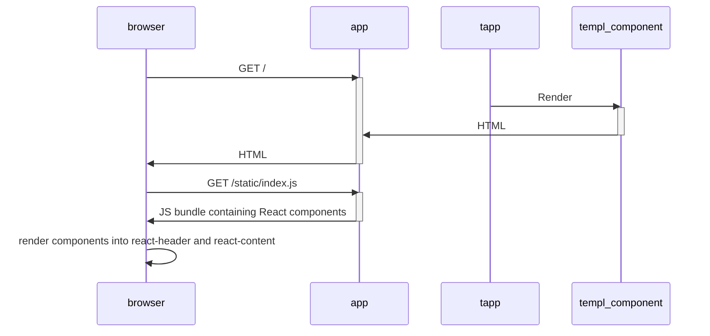

### Install templ Globally with Go

Source: https://templ.guide/llms

Installs the `templ` command-line tool globally on the system using `go install`, making it accessible from any directory.

```bash
go install github.com/a-h/templ/cmd/templ@latest
```

---

### Install templ as a Local Go Tool

Source: https://templ.guide/llms

Installs `templ` as a project-local Go tool using `go get -tool`, leveraging Go's tool directive feature for managing project-specific executables.

```bash
go get -tool github.com/a-h/templ/cmd/templ@latest
```

---

### Go: Install `goquery` Library

Source: https://templ.guide/llms

Command to install the `goquery` library, a jQuery-like library for Go, which is useful for parsing and querying HTML in Go applications, particularly for expectation testing of templ output.

```Go
go get github.com/PuerkitoBio/goquery
```

---

### Verify Go, Gopls, and Templ Binary Paths

Source: https://templ.guide/llms

This command checks if the `go`, `gopls`, and `templ` binaries are installed and accessible in the system's PATH. It's a crucial first step for troubleshooting environment setup issues.

```bash
which go gopls templ
```

---

### Example templ Application for Live Reload

Source: https://templ.guide/llms

This snippet provides the necessary Go and templ files to set up a basic web server and a templ component, demonstrating how they integrate with templ's live reload functionality for development.

```go
package main

import (
	"fmt"
	"net/http"

	"github.com/a-h/templ"
)

func main() {
	component := hello("World")

	http.Handle("/", templ.Handler(component))

	fmt.Println("Listening on :8080")
	http.ListenAndServe(":8080", nil)
}
```

```templ
package main

templ hello(name string) {
  <body>
	    <div>Hello, { name }</div>
  </body>
}
```

---

### Serve Static JavaScript Assets with Go HTTP Server

Source: https://templ.guide/llms

This Go `main` function initializes an HTTP server, configuring a handler to serve static JavaScript assets from the local `assets` directory under the `/assets/` URL path. It also sets up routing for Templ components and starts the server on `localhost:8080`, demonstrating a complete backend setup for serving frontend resources.

```Go
func main() {
	mux := http.NewServeMux()
	// Serve the JS bundle.
	mux.Handle("/assets/", http.StripPrefix("/assets/", http.FileServer(http.Dir("assets"))))

	// Serve components.
	data := map[string]any{"msg": "Hello, World!"}
	h := templ.Handler(components.Page(data))
	mux.Handle("/", h)

	fmt.Println("Listening on http://localhost:8080")
	http.ListenAndServe("localhost:8080", mux)
}
```

---

### Serving Static Templ Components in Go

Source: https://templ.guide/llms

This example demonstrates how to define a static `templ` component and serve it using a standard Go HTTP server. It shows the `templ` component definition and the Go `main` function that uses `templ.Handler` to serve it.

```templ
package main

templ hello() {
	<div>Hello</div>
}
```

```go
package main

import (
	"net/http"

	"github.com/a-h/templ"
)

func main() {
	http.Handle("/", templ.Handler(hello()))

	http.ListenAndServe(":8080", nil)
}
```

---

### Configure Go HTTP Server Entrypoint with templ

Source: https://templ.guide/llms

This Go code sets up an HTTP server, initializes a database store, and configures session middleware. It demonstrates a typical entrypoint for a templ application, handling dependencies and starting the server on port 9000.

```go
package main

import (
	"fmt"
	"net/http"
	os"
	"time"

	"github.com/a-h/templ/examples/counter/db"
	"github.com/a-h/templ/examples/counter/handlers"
	"github.com/a-h/templ/examples/counter/services"
	"github.com/a-h/templ/examples/counter/session"
	"golang.org/x/exp/slog"
)

func main() {
	log := slog.New(slog.NewJSONHandler(os.Stderr))
	s, err := db.NewCountStore(os.Getenv("TABLE_NAME"), os.Getenv("AWS_REGION"))
	if err != nil {
		log.Error("failed to create store", slog.Any("error", err))
		os.Exit(1)
	}
	cs := services.NewCount(log, s)
	h := handlers.New(log, cs)

	var secureFlag = true
	if os.Getenv("SECURE_FLAG") == "false" {
		secureFlag = false
	}

	// Add session middleware.
	sh := session.NewMiddleware(h, session.WithSecure(secureFlag))

	server := &http.Server{
		Addr:         "localhost:9000",
		Handler:      sh,
		ReadTimeout:  time.Second * 10,
		WriteTimeout: time.Second * 10,
	}

	fmt.Printf("Listening on %v\n", server.Addr)
	server.ListenAndServe()
}
```

---

### Example HTML Output from templ Component

Source: https://templ.guide/llms

Shows a sample of the HTML output generated by a templ component when rendered.

```html
<div>Hello, John</div>
```

---

### Initialize a TypeScript Project with npm

Source: https://templ.guide/llms

This bash script outlines the steps to set up a new TypeScript project using `npm`. It includes creating the project directory, initializing `npm`, and installing `typescript` and `esbuild` as development dependencies for transpilation and bundling.

```bash
mkdir ts
cd ts
npm init
npm install --save-dev typescript esbuild
```

---

### Define a templ Component

Source: https://templ.guide/llms

Example `hello.templ` file defining a simple templ component named `hello` that takes a `name` string and renders a `div` containing 'Hello, {name}'.

```templ
package main

templ hello(name string) {
	<div>Hello, { name }</div>
}
```

---

### Multi-stage Dockerfile for templ Applications

Source: https://templ.guide/llms

A comprehensive multi-stage Dockerfile example for building Go applications that utilize `templ`. It includes stages for Go module fetching, templ code generation, and final application compilation, ensuring proper permissions and efficient image size.

```dockerfile
FROM golang:latest AS fetch-stage
COPY go.mod go.sum /app
WORKDIR /app
RUN go mod download

FROM ghcr.io/a-h/templ:latest AS generate-stage
COPY --chown=65532:65532 . /app
WORKDIR /app
RUN ["templ", "generate"]

FROM golang:latest AS build-stage
COPY --from=generate-stage /app /app
WORKDIR /app
RUN CGO_ENABLED=0 GOOS=linux go build -o /app/app
```

---

### Generating Go Code from templ Files

Source: https://templ.guide/llms

This section provides the command-line instruction to generate Go code from `*.templ` files using the `templ generate` command. It also includes an example of the command's output, showing warnings and a summary of the generation process.

```shell
templ generate
```

```text
(!) void element <input> should not have child content [ from=12:2 to=12:7 ]
(✓) Complete [ updates=62 duration=144.677334ms ]
```

---

### Run templ with Nix Flake

Source: https://templ.guide/llms

Executes the `templ` binary directly from its Nix flake, providing a convenient way to use the tool without a full system installation.

```bash
nix run github:a-h/templ
```

---

### Install Vim LSP and Autocomplete Plugins for Templ

Source: https://templ.guide/llms

This snippet shows how to install necessary Vim plugins (vim-lsp, asyncomplete.vim, asyncomplete-lsp.vim) using vim-plug for Templ language server protocol and autocomplete support. Requires Vim 8+.

```vim
Plug 'prabirshrestha/vim-lsp'
Plug 'prabirshrestha/asyncomplete.vim'
Plug 'prabirshrestha/asyncomplete-lsp.vim'
```

---

### Integrate templ into Nix Flake Configuration

Source: https://templ.guide/llms

Provides a Nix flake configuration example for integrating `templ` into a NixOS system or a flake project, demonstrating how to add the `templ` overlay and use it in build inputs or system packages.

```nix
{ inputs = {
    ...
    templ.url = "github:a-h/templ";
    ...
  };
  outputs = inputs@{
    ...
  }:

  # For NixOS configuration:
  {
    # Add the overlay,
    nixpkgs.overlays = [
      inputs.templ.overlays.default
    ];
    # and install the package
    environment.systemPackages = with pkgs; [
      templ
    ];
  };

  # For a flake project:
  let
    forAllSystems = f: nixpkgs.lib.genAttrs allSystems (system: f {
      inherit system;
      pkgs = import nixpkgs { inherit system; };
    });
    templ = system: inputs.templ.packages.${system}.templ;
  in {
    packages = forAllSystems ({ pkgs, system }: {
      myNewPackage = pkgs.buildGoModule {
        ...
        preBuild = ''
          ${templ system}/bin/templ generate
        '';
      };
    });

    devShell = forAllSystems ({ pkgs, system }:
      pkgs.mkShell {
        buildInputs = with pkgs; [
          go
          (templ system)
        ];
      };
  });
}
```

---

### Define and Render Basic templ Elements

Source: https://templ.guide/llms

This example illustrates the fundamental process of defining a reusable templ element and rendering it from a Go application. It shows how a simple `button` component is created in templ, then instantiated and rendered to standard output in Go, demonstrating the resulting HTML.

```templ
package main

templ button(text string) {
	<button class="button">{ text }</button>
}
```

```go
package main

import (
	"context"
	"os"
)

func main() {
	button("Click me").Render(context.Background(), os.Stdout)
}
```

```html
<button class="button">Click me</button>
```

---

### Generated HTML Output for Templ Script Example

Source: https://templ.guide/llms

This HTML snippet shows the output generated by the `templ` and Go code for the console logging example. It illustrates how `templ` compiles the `script` component into a uniquely named JavaScript function and then injects calls to this function with the JSON-encoded Go data directly into the HTML `<body>`.

```html
<html>
  <body>
    <script>
      function __templ_printToConsole_5a85(content) {
        console.log(content);
      }
    </script>

    <script>
      __templ_printToConsole_5a85("2023-11-11 01:01:40.983381358 +0000 UTC");
    </script>

    <script>
      __templ_printToConsole_5a85(
        "Again: 2023-11-11 01:01:40.983381358 +0000 UTC"
      );
    </script>
  </body>
</html>
```

---

### Serve Fixed Templ Components with Go HTTP Server

Source: https://templ.guide/llms

Sets up a basic Go HTTP server using `net/http` to serve the previously defined `templ` components. It demonstrates how to use `templ.Handler` to serve a component with a fixed value (server start time) and how to apply HTTP status codes.

```go
package main

import (
	"net/http"
	"time"

	"github.com/a-h/templ"
)

func main() {
	http.Handle("/", templ.Handler(timeComponent(time.Now())))
	http.Handle("/404", templ.Handler(notFoundComponent(), templ.WithStatus(http.StatusNotFound)))

	http.ListenAndServe(":8080", nil)
}
```

---

### Test Templ LSP Binary Execution

Source: https://templ.guide/llms

This command verifies that the `templ` binary can be executed and its LSP help text is displayed. This confirms the binary is functional and correctly installed, aiding in troubleshooting execution issues.

```bash
templ lsp --help
```

---

### Example YAML Translation File for Internationalization

Source: https://templ.guide/llms

Provides an example of a YAML file structure used for storing internationalization strings. This snippet shows how to define key-value pairs for different locales, such as 'hello' and 'select_language' for English.

```yaml
en:
  hello: "Hello"
  select_language: "Select Language"
```

---

### Install Vim Plugin for Templ Indentation and Tcomment Support

Source: https://templ.guide/llms

This snippet shows how to install the 'iefserge/templ.vim' plugin using vim-plug. This optional plugin improves indentation for Templ files to better match Go syntax outside of templ blocks and adds support for tcomment_vim.

```vim
Plug 'iefserge/templ.vim'
```

---

### Defining and Using templ Method Components

Source: https://templ.guide/llms

This snippet illustrates how `templ` components can be defined as methods on Go types, allowing them to access the type's fields. It provides two examples: a basic definition and usage, and an advanced example demonstrating inline initialization and calling of a method component within another `templ` component.

```templ
package main

import "os"

type Data {
	message string
}

templ (d Data) Method() {
	<div>{ d.message }</div>
}

func main() {
	d := Data{
		message: "You can implement methods on a type.",
	}
	d.Method().Render(context.Background(), os.Stdout)
}
```

```templ
package main

import "os"

type Data {
	message string
}

templ (d Data) Method() {
	<div>{ d.message }</div>
}

templ Message() {
    <div>
        @Data{
            message: "You can implement methods on a type.",
        }.Method()
    </div>
}
```

---

### Example `index.html` Generated by templ

Source: https://templ.guide/llms

This HTML snippet displays the content of the `index.html` file, which is automatically generated by `templ`. It serves as the main entry point for the website, containing links to other generated content pages.

```HTML
<title>
 My Website
</title>
<h1>
 My Website
</h1>
<div>
 <a href="2023/01/01/happy-new-year/">
  Happy New Year!
 </a>
</div>
<div>
 <a href="2023/05/01/may-day/">
  May Day
 </a>
</div>
```

---

### templ generate Command Reference

Source: https://templ.guide/llms

Comprehensive documentation for the 'templ generate' command, detailing its purpose to generate Go code from '.templ' files. It lists all available arguments, their default values, and provides an example for generating code for a single file.

```APIDOC
usage: templ generate [<args>...]

Generates Go code from templ files.

Args:
  -path <path>
    Generates code for all files in path. (default .)
  -f <file>
    Optionally generates code for a single file, e.g. -f header.templ
  -source-map-visualisations
    Set to true to generate HTML files to visualise the templ code and its corresponding Go code.
  -include-version
    Set to false to skip inclusion of the templ version in the generated code. (default true)
  -include-timestamp
    Set to true to include the current time in the generated code.
  -watch
    Set to true to watch the path for changes and regenerate code.
  -cmd <cmd>
    Set the command to run after generating code.
  -proxy
    Set the URL to proxy after generating code and executing the command.
  -proxyport
    The port the proxy will listen on. (default 7331)
  -proxybind
    The address the proxy will listen on. (default 127.0.0.1)
  -w
    Number of workers to use when generating code. (default runtime.NumCPUs)
  -lazy
    Only generate .go files if the source .templ file is newer.
  -pprof
    Port to run the pprof server on.
  -keep-orphaned-files
    Keeps orphaned generated templ files. (default false)
  -v
    Set log verbosity level to "debug". (default "info")
  -log-level
    Set log verbosity level. (default "info", options: "debug", "info", "warn", "error")
  -help
    Print help and exit.

For example, to generate code for a single file:
templ generate -f header.templ
```

---

### Run Go Application from Terminal

Source: https://templ.guide/llms

This bash command executes a Go program, typically starting a web server or other application defined in the Go source files within the current directory.

```bash
go run *.go
```

---

### Implementing Code-Only templ Components in Go

Source: https://templ.guide/llms

This example demonstrates how to create `templ` components directly in Go code without using `*.templ` files, by implementing the `templ.Component` interface via `templ.ComponentFunc`. It shows a simple button component and its rendered HTML output, highlighting the responsibility for manual HTML escaping.

```go
package main

import (
	"context"
	"io"
	os"
	"github.com/a-h/templ"
)

func button(text string) templ.Component {
	return templ.ComponentFunc(func(ctx context.Context, w io.Writer) error {
		_, err := io.WriteString(w, "<button>"+text+"</button>")
		return err
	})
}

func main() {
	button("Click me").Render(context.Background(), os.Stdout)
}
```

```html
<button>Click me</button>
```

---

### Go HTTP Handler: Request Handling and Templ Rendering

Source: https://templ.guide/llms

This Go code implements the `http.Handler` interface for `DefaultHandler`. It includes `ServeHTTP` for routing `GET` and `POST` requests, `Get` and `Post` methods for interacting with the `CountService` to retrieve or increment counters, and a `View` method to render HTML responses using templ components.

```go
func (h *DefaultHandler) ServeHTTP(w http.ResponseWriter, r *http.Request) {
	if r.Method == http.MethodPost {
		h.Post(w, r)
		return
	}
	h.Get(w, r)
}

func (h *DefaultHandler) Get(w http.ResponseWriter, r *http.Request) {
	var props ViewProps
	var err error
	props.Counts, err = h.CountService.Get(r.Context(), session.ID(r))
	if err != nil {
		h.Log.Error("failed to get counts", slog.Any("error", err))
		http.Error(w, "failed to get counts", http.StatusInternalServerError)
		return
	}
	h.View(w, r, props)
}

func (h *DefaultHandler) Post(w http.ResponseWriter, r *http.Request) {
	r.ParseForm()

	// Decide the action to take based on the button that was pressed.
	var it services.IncrementType
	if r.Form.Has("global") {
		it = services.IncrementTypeGlobal
	}
	if r.Form.Has("session") {
		it = services.IncrementTypeSession
	}

	counts, err := h.CountService.Increment(r.Context(), it, session.ID(r))
	if err != nil {
		h.Log.Error("failed to increment", slog.Any("error", err))
		http.Error(w, "failed to increment", http.StatusInternalServerError)
		return
	}

	// Display the view.
	h.View(w, r, ViewProps{
		Counts: counts,
	})
}

type ViewProps struct {
	Counts services.Counts
}

func (h *DefaultHandler) View(w http.ResponseWriter, r *http.Request, props ViewProps) {
	components.Page(props.Counts.Global, props.Counts.Session).Render(r.Context(), w)
}
```

---

### Prop Drilling Example in Templ

Source: https://templ.guide/llms

Demonstrates 'prop drilling' where data is passed through intermediate components that don't directly use it, but merely forward it to child components. This illustrates how every component in the hierarchy must accept and pass parameters.

```templ
package main

templ top(name string) {
	<div>
		@middle(name)
	</div>
}

templ middle(name string) {
	<ul>
		@bottom(name)
	</ul>
}

templ bottom(name string) {
  <li>{ name }</li>
}
```

---

### Rendered HTML Output for templ ProgressBar Component

Source: https://templ.guide/llms

Example of the HTML output generated by the `ProgressBar` `templ` component when `percent` is 75, showing the combined dynamic styles.

```HTML
<div style="transition:width 0.3s ease;width:75%;" class="progress-bar">
    <div class="progress-fill"></div>
</div>
```

---

### Passing Templ Components as Parameters via Go

Source: https://templ.guide/llms

Illustrates how to define Templ components that accept other components as parameters. The example shows a `layout` component accepting a `contents` component, which is then rendered from Go code by passing a `paragraph` component instance.

```go
package main

import (
	"context"
	os"
)

func main() {
	c := paragraph("Dynamic contents")
	layout(c).Render(context.Background(), os.Stdout)
}
```

```html
<div id="heading">
  <h1>Heading</h1>
</div>
<div id="contents">
  <p>Dynamic contents</p>
</div>
```

---

### Go Backend Implementation for Datastar Counter

Source: https://templ.guide/llms

This Go code implements the backend logic for the Datastar counter example. It sets up HTTP routes using `go-chi`, manages a global counter using `atomic.Uint32`, and a per-user counter using `gorilla/sessions`. The code handles POST requests to increment these counters and uses Datastar's SSE helpers to push updated signal values back to the frontend.

```go
package site

import (
	"net/http"
	"sync/atomic"

	"github.com/Jeffail/gabs/v2"
	"github.com/go-chi/chi/v5"
	"github.com/gorilla/sessions"
	datastar "github.com/starfederation/datastar/sdk/go"
)

func setupExamplesTemplCounter(examplesRouter chi.Router, sessionSignals sessions.Store) error {

	var globalCounter atomic.Uint32
	const (
		sessionKey = "templ_counter"
		countKey   = "count"
	)

	userVal := func(r *http.Request) (uint32, *sessions.Session, error) {
		sess, err := sessionSignals.Get(r, sessionKey)
		if err != nil {
			return 0, nil, err
		}

		val, ok := sess.Values[countKey].(uint32)
		if !ok {
			val = 0
		}
		return val, sess, nil
	}

	examplesRouter.Get("/templ_counter/data", func(w http.ResponseWriter, r *http.Request) {
		userVal, _, err := userVal(r)
		if err != nil {
			http.Error(w, err.Error(), http.StatusInternalServerError)
		}

		signals := TemplCounterSignals{
			Global: globalCounter.Load(),
			User:   userVal,
		}

		c := templCounterExampleInitialContents(signals)
		datastar.NewSSE(w, r).MergeFragmentTempl(c)
	})

	updateGlobal := func(signals *gabs.Container) {
		signals.Set(globalCounter.Add(1), "global")
	}

	examplesRouter.Route("/templ_counter/increment", func(incrementRouter chi.Router) {
		incrementRouter.Post("/global", func(w http.ResponseWriter, r *http.Request) {
			update := gabs.New()
			updateGlobal(update)

			datastar.NewSSE(w, r).MarshalAndMergeSignals(update)
		})

		incrementRouter.Post("/user", func(w http.ResponseWriter, r *http.Request) {
			val, sess, err := userVal(r)
			if err != nil {
				http.Error(w, err.Error(), http.StatusInternalServerError)
			}

			val++
			sess.Values[countKey] = val
			if err := sess.Save(r, w); err != nil {
				http.Error(w, err.Error(), http.StatusInternalServerError)
			}

			update := gabs.New()
			updateGlobal(update)
			update.Set(val, "user")

			datastar.NewSSE(w, r).MarshalAndMergeSignals(update)
		})
	})

	return nil
}
```

---

### Example HTML Output from templ Component

Source: https://templ.guide/llms

This snippet shows the expected HTML output generated by the `hello` templ component when rendered with the name 'John'.

```html
<div>Hello, John</div>
```

---

### Initialize Go Application with i18n Middleware

Source: https://templ.guide/llms

This Go main function initializes the application by loading internationalization content using ctxi18n.Load. It then sets up an HTTP server, registers a templ handler, and wraps the router with the newLanguageMiddleware to enable language selection based on URL paths before starting the server.

```Go
func main() {
	if err := ctxi18n.Load(locales.Content); err != nil {
		log.Fatalf("error loading locales: %v", err)
	}

	mux := http.NewServeMux()
	mux.Handle("/", templ.Handler(page()))

	withLanguageMiddleware := newLanguageMiddleware(mux);

	log.Println("listening on :8080")
	if err := http.ListenAndServe("127.0.0.1:8080", withLanguageMiddleware); err != nil {
		log.Printf("error listening: %v", err)
	}
}
```

---

### Include Datastar Client-Side Library in Templ Applications

Source: https://templ.guide/llms

Explains how to integrate the Datastar client-side library into `templ` applications using provided helper functions. It highlights the use of `@datastar.ScriptCDNLatest()` or `ScriptCDNVersion()` to include the library from a CDN, simplifying setup for dynamic web features.

```Go
@datastar.ScriptCDNLatest()
@datastar.ScriptCDNVersion(version string)
```

---

### Rendered HTML Output for templ DraggableElement Component

Source: https://templ.guide/llms

Example of the HTML output generated by the `DraggableElement` `templ` component, demonstrating the application of `templ.SafeCSS` for dynamic `transform` styles.

```HTML
<div style="transform: translate(20px, 40px);">
    Drag me
</div>
```

---

### templ CLI: `generate` Command Usage Examples

Source: https://templ.guide/llms

Illustrates common usage patterns for the `templ generate` command, including generating code for all files in the current directory, generating code for a specific file, and setting up a watch process for continuous regeneration upon file changes.

```Shell
templ generate

templ generate -f header.templ

templ generate -watch
```

---

### Templ parser error: Unescaped keyword at text start

Source: https://templ.guide/llms

Shows a `templ` parser error that arises when a text block directly starts with `if`, `switch`, or `for` without being enclosed in a Go string expression or capitalized, as the parser expects a control flow statement.

```templ
package main

templ text(b bool) {
	<p>if a tree fell in the woods</p>
}
```

---

### templ fmt Command Reference

Source: https://templ.guide/llms

This documentation describes the 'templ fmt' command, which is used for formatting 'templ' files. It provides examples for formatting all files in the current directory, processing input from stdin, and using the '-fail' option for continuous integration (CI) checks to ensure proper formatting.

```APIDOC
The `templ fmt` command formats template files. You can use this command in different ways:

1. Format all template files in the current directory and subdirectories:

templ fmt .

2. Format input from stdin and output to stdout:

templ fmt

Alternatively, you can run `fmt` in CI to ensure that invalidly formatted templatess do not pass CI. This will cause the command
to exit with unix error-code `1` if any templates needed to be modified.

templ fmt -fail .
```

---

### Serve Static Assets with Go HTTP FileServer

Source: https://templ.guide/llms

This Go example demonstrates how to serve static assets, including JavaScript files, from a local directory using Go's `http.FileServer`. It configures a `http.ServeMux` to handle requests for a specific path prefix, stripping the prefix before serving files from the designated directory.

```go
mux := http.NewServeMux()
mux.Handle("/assets/", http.StripPrefix("/assets/", http.FileServer(http.Dir("assets"))))
http.ListenAndServe("localhost:8080", mux)
```

---

### Create a Basic TypeScript File

Source: https://templ.guide/llms

This snippet shows how to create a simple TypeScript file (`index.ts`) within the `src` directory of an NPM project. It defines a basic `hello` function, serving as a starting point for TypeScript development.

```typescript
function hello() {
  console.log("Hello, from TypeScript");
}
```

---

### Sanitizing Class Names and SafeClass Usage in templ

Source: https://templ.guide/llms

This `templ` example demonstrates `templ`'s automatic sanitization of class names to prevent injection. Unsafe characters are replaced, and a fallback class is used if sanitization fails. It also shows how `templ.SafeClass` can bypass some sanitization, though the output is still HTML-escaped, as seen in the rendered output example.

```templ
templ Example() {
  <div class={ "unsafe</style&gt;-will-sanitized", templ.SafeClass("&sanitization bypassed") }></div>
}
```

```HTML
<div class="--templ-css-class-safe-name &amp;sanitization bypassed"></div>
```

---

### Compose Templ Components Using Import Expressions

Source: https://templ.guide/llms

This example illustrates how to compose multiple smaller Templ components (`left`, `middle`, `right`) into a larger template (`showAll`) using the `@` import expression. This promotes modularity and reusability in Templ applications.

```templ
templ showAll() {
	@left()
	@middle()
	@right()
}

templ left() {
	<div>Left</div>
}

templ middle() {
	<div>Middle</div>
}

templ right() {
	<div>Right</div>
}
```

---

### Rendered HTML Output for templ TextInput Component

Source: https://templ.guide/llms

Example of the HTML output generated by the `TextInput` `templ` component when `hasError` is true, showing the conditionally applied styles.

```HTML
<input
    type="text"
    value=""
    style="border-color: #ff3860; background-color: #fff5f7; padding: 0.5em 1em;">
```

---

### Watching and Compiling Tailwind CSS for Live Reload

Source: https://templ.guide/llms

Demonstrates the `npx tailwindcss` command to watch `input.css` and `.templ` files, then compile and minify the CSS output to `assets/styles.css`. This setup ensures that CSS changes trigger a live reload, suitable for a `Makefile` workflow.

```bash
npx --yes tailwindcss -i ./input.css -o ./assets/styles.css --minify --watch
```

---

### Neovim Minimal Configuration for Templ Development

Source: https://templ.guide/llms

This Lua configuration file (`init.lua`) sets up a minimal Neovim environment tailored for `templ` development. It includes the `lazy.nvim` plugin manager for installing and managing plugins, integrates Language Server Protocol (LSP) for `templ`, `tailwindcss`, `html`, and `htmx` via `nvim-lspconfig`, configures `nvim-cmp` for intelligent autocompletion, and utilizes `nvim-treesitter` with `tree-sitter-templ` for robust syntax highlighting. It also ensures `templ` files are correctly recognized by Neovim.

```lua
local lazypath = vim.fn.stdpath("data") .. "/lazy/lazy.nvim"
if not vim.loop.fs_stat(lazypath) then
  vim.fn.system({
    "git",
    "clone",
    "--filter=blob:none",
    "https://github.com/folke/lazy.nvim.git",
    "--branch=stable", -- latest stable release
    lazypath,
  })
end
vim.opt.rtp:prepend(lazypath)
vim.g.mapleader = " " -- Make sure to set `mapleader` before lazy so your mappings are correct

require("lazy").setup({
  'neovim/nvim-lspconfig',
  {
    -- Autocompletion
    'hrsh7th/nvim-cmp',
    dependencies = {
      'hrsh7th/cmp-nvim-lsp',
    },
  },
  {
    -- Highlight, edit, and navigate code
    'nvim-treesitter/nvim-treesitter',
    dependencies = {
      'vrischmann/tree-sitter-templ',
    },
    build = ':TSUpdate',
  },
})

vim.filetype.add({ extension = { templ = "templ" } })

capabilities = require('cmp_nvim_lsp').default_capabilities(capabilities)
local lspconfig = require("lspconfig")

lspconfig.templ.setup{
  on_attach = on_attach,
  capabilities = capabilities,
}

lspconfig.tailwindcss.setup({
  on_attach = on_attach,
  capabilities = capabilities,
  filetypes = { "templ", "astro", "javascript", "typescript", "react" },
  init_options = { userLanguages = { templ = "html" } },
})

lspconfig.html.setup({
  on_attach = on_attach,
  capabilities = capabilities,
  filetypes = { "html", "templ" },
})

lspconfig.htmx.setup({
  on_attach = on_attach,
  capabilities = capabilities,
  filetypes = { "html", "templ" },
})

local cmp = require 'cmp'
cmp.setup({
  mapping = cmp.mapping.preset.insert({
    ['<C-b>'] = cmp.mapping.scroll_docs(-4),
    ['<C-f>'] = cmp.mapping.scroll_docs(4),
    ['<C-Space>'] = cmp.mapping.complete(),
    ['<C-e>'] = cmp.mapping.abort(),
    ['<CR>'] = cmp.mapping.confirm({ select = true }),
  }),
  sources = cmp.config.sources({
    { name = 'nvim_lsp' },
  })
})

require'nvim-treesitter.configs'.setup {
  ensure_installed = { "templ" },
  sync_install = false,
  auto_install = true,
  ignore_install = { "javascript" },
  highlight = {
    enable = true,
  },
}
```

---

### Define a Basic templ Component Structure

Source: https://templ.guide/llms

This example showcases the fundamental structure of a templ component. It defines a component named `headerTemplate` that accepts a string argument and renders a simple HTML `<header>` element containing an `<h1>` tag with the provided name. Components encapsulate markup and logic, compiling into Go functions.

```templ
package main

templ headerTemplate(name string) {
  <header data-testid="headerTemplate">
    <h1>{ name }</h1>
  </header>
}
```

---

### Test Local Web Server with Curl

Source: https://templ.guide/llms

This bash command uses `curl` to send an HTTP GET request to a local web server running on port 3000, demonstrating how to verify the server's output.

```bash
curl localhost:3000
```

---

### Initialize Go Project for templ Development

Source: https://templ.guide/llms

These bash commands demonstrate the steps to set up a new Go project directory, initialize a Go module, and fetch the `templ` dependency, preparing the environment for templ component development.

```bash
mkdir hello-world
```

```bash
cd hello-world
```

```bash
go mod init github.com/a-h/templ-examples/hello-world
```

```bash
go get github.com/a-h/templ
```

---

### Initialize sample blog post data in Go

Source: https://templ.guide/llms

This Go snippet initializes a slice of `Post` structs with sample blog content. Each `Post` includes a date, title, and multi-line markdown content, demonstrating how to prepare data that will be rendered into static blog pages.

```go
posts := []Post{
	{
		Date:  time.Date(2023, time.January, 1, 0, 0, 0, 0, time.UTC),
		Title: "Happy New Year!",
		Content: `New Year is a widely celebrated occasion in the United Kingdom, marking the end of one year and the beginning of another.

Top New Year Activities in the UK include:

* Attending a Hogmanay celebration in Scotland
* Taking part in a local First-Foot tradition in Scotland and Northern England
* Setting personal resolutions and goals for the upcoming year
* Going for a New Year's Day walk to enjoy the fresh start
* Visiting a local pub for a celebratory toast and some cheer
`,
	},
	{
		Date:  time.Date(2023, time.May, 1, 0, 0, 0, 0, time.UTC),
		Title: "May Day",
		Content: `May Day is an ancient spring festival celebrated on the first of May in the United Kingdom, embracing the arrival of warmer weather and the renewal of life.

Top May Day Activities in the UK:

* Dancing around the Maypole, a traditional folk activity
* Attending local village fetes and fairs
* Watching or participating in Morris dancing performances
* Enjoying the public holiday known as Early May Bank Holiday
`,
	},
}
```

---

### Example Content Page HTML Generated by templ

Source: https://templ.guide/llms

This HTML snippet illustrates the structure and content of a typical page generated by `templ` for a specific post or article. It includes the page title, main heading, and the HTML content derived from markdown, wrapped within the template.

```HTML
<title>
 May Day
</title>
<h1>
 May Day
</h1>
<div class="content">
 <p>
  May Day is an ancient spring festival celebrated on the first of May in the United Kingdom, embracing the arrival of warmer weather and the renewal of life.
 </p>
 <p>
  Top May Day Activities in the UK:
 </p>
 <ul>
  <li>
   Dancing around the Maypole, a traditional folk activity
  </li>
  <li>
   Attending local village fetes and fairs
  </li>
  <li>
   Watching or participating in Morris dancing performances
  </li>
  <li>
   Enjoying the public holiday known as Early May Bank Holiday
  </li>
 </ul>
</div>
```

---

### Go Program to Render templ Component to File

Source: https://templ.guide/llms

A Go program (`main.go`) that demonstrates how to render a `templ.Component` (the `hello` component) to an HTML file (`hello.html`) using `os.Create` and the component's `Render` method.

```Go
package main

import (
	"context"
	"log"
	"os"
)

func main() {
	f, err := os.Create("hello.html")
	if err != nil {
		log.Fatalf("failed to create output file: %v", err)
	}

	err = hello("John").Render(context.Background(), f)
	if err != nil {
		log.Fatalf("failed to write output file: %v", err)
	}
}
```

---

### Enable Tree-sitter Highlight for Templ Files on Buffer Enter

Source: https://templ.guide/llms

Sets up an autocmd to automatically enable Tree-sitter syntax highlighting for `.templ` files whenever a buffer containing such a file is entered. This resolves issues where highlighting might not be active by default after installation or when reopening files.

```lua
vim.api.nvim_create_autocmd("BufEnter", { pattern = "*.templ", callback = function() vim.cmd("TSBufEnable highlight") end })
```

---

### Initialize Go Module

Source: https://templ.guide/llms

Commands to navigate into the new project directory and initialize a Go module, setting up the project for dependency management.

```bash
cd static-generator
go mod init github.com/a-h/templ-examples/static-generator
```

---

### Use Go Expressions in templ Attributes and Content

Source: https://templ.guide/llms

This example demonstrates how templ elements can incorporate Go expressions for dynamic attribute values and content. It shows a `button` component that takes `name` and `content` parameters, which are then interpolated into the HTML, illustrating how templ renders dynamic data.

```templ
package main

templ button(name string, content string) {
	<button value={ name }>{ content }</button>
}
```

```go
func main() {
	component := button("John", "Say Hello")
	component.Render(context.Background(), os.Stdout)
}
```

```html
<button value="John">Say Hello</button>
```

---

### Go Program to Render templ Component to Stdout

Source: https://templ.guide/llms

A Go program demonstrating how to instantiate a `templ.Component` and render its HTML output directly to standard output using `os.Stdout`.

```go
package main

import (
	"context"
	os"
)

func main() {
	component := hello("John")
	component.Render(context.Background(), os.Stdout)
}
```

---

### Generate static blog pages using templ and Go

Source: https://templ.guide/llms

This `main.go` program orchestrates the static site generation. It creates a 'public' directory, renders the `indexPage` to `index.html`, and then iterates through each `Post`. For each post, it converts markdown content to HTML using `goldmark`, wraps it in an `Unsafe` component, and renders a dedicated HTML file using `contentPage`, organizing output by date and slug.

```go
package main

import (
	"bytes"
	"context"
	"io"
	"log"
	"os"
	"path"
	"time"

	"github.com/a-h/templ"
	"github.com/gosimple/slug"
	"github.com/yuin/goldmark"
)

func main() {
	// Output path.
	rootPath := "public"
	if err := os.Mkdir(rootPath, 0755); err != nil {
		log.Fatalf("failed to create output directory: %v", err)
	}

	// Create an index page.
	name := path.Join(rootPath, "index.html")
	f, err := os.Create(name)
	if err != nil {
		log.Fatalf("failed to create output file: %v", err)
	}
	// Write it out.
	err = indexPage(posts).Render(context.Background(), f)
	if err != nil {
		log.Fatalf("failed to write index page: %v", err)
	}

	// Create a page for each post.
	for _, post := range posts {
		// Create the output directory.
		dir := path.Join(rootPath, post.Date.Format("2006/01/02"), slug.Make(post.Title))
		if err := os.MkdirAll(dir, 0755); err != nil && err != os.ErrExist {
			log.Fatalf("failed to create dir %q: %v", dir, err)
		}

		// Create the output file.
		name := path.Join(dir, "index.html")
		f, err := os.Create(name)
		if err != nil {
			log.Fatalf("failed to create output file: %v", err)
		}

		// Convert the markdown to HTML, and pass it to the template.
		var buf bytes.Buffer
		if err := goldmark.Convert([]byte(post.Content), &buf); err != nil {
			log.Fatalf("failed to convert markdown to HTML: %v", err)
		}

		// Create an unsafe component containing raw HTML.
		content := Unsafe(buf.String())

		// Use templ to render the template containing the raw HTML.
		err = contentPage(post.Title, content).Render(context.Background(), f)
		if err != nil {
			log.Fatalf("failed to write output file: %v", err)
		}
	}
}
```

---

### Templ Script for Direct Console Logging

Source: https://templ.guide/llms

This `templ` example demonstrates how `script` elements can be treated as `templ` components and directly rendered using the `@` expression. The `printToConsole` script takes a string, which is then JSON-encoded when passed from Go, allowing it to be used directly in JavaScript's `console.log`.

```templ
package main

import "fmt"

script printToConsole(content string) {
	console.log(content)
}

templ page(content string) {
	<html>
		<body>
		  @printToConsole(content)
		  @printToConsole(fmt.Sprintf("Again: %s", content))
		</body>
	</html>
}
```

---

### Handling text starting with 'if', 'switch', or 'for' in templ

Source: https://templ.guide/llms

Explains how to correctly render text that begins with keywords like `if`, `switch`, or `for` in `templ` by using Go string expressions or capitalizing the keyword to avoid parser conflicts. It also shows basic string formatting with `fmt.Sprintf`.

```templ
package main

templ display(price float64, count int) {
	<p>Switch to Linux</p>
	<p>{ `switch to Linux` }</p>
	<p>{ "for a day" }</p>
	<p>{ fmt.Sprintf("%f", price) }{ "for" }{ fmt.Sprintf("%d", count) }</p>
	<p>{ fmt.Sprintf("%f for %d", price, count) }</p>
}
```

---

### Interpolate Go Variables into templ Components

Source: https://templ.guide/llms

This example demonstrates how templ components can dynamically display content by interpolating Go variables. It shows the use of function parameters, struct fields, and package-level constants within templ elements, highlighting how templ accesses and renders in-scope Go data.

```templ
package main

templ greet(prefix string, p Person) {
  <div>{ prefix } { p.Name }{ exclamation }</div>
  <div>Congratulations on being { p.Age }!</div>
}
```

```go
package main

type Person struct {
  Name string
  Age  int
}

const exclamation = "!"

func main() {
  p := Person{ Name: "John", Age: 42 }
  component := greet("Hello", p)
  component.Render(context.Background(), os.Stdout)
}
```

```html
<div>Hello John!</div>
<div>Congratulations on being 42!</div>
```

---

### Handling `on*` Attributes with `templ.ComponentScript` in templ

Source: https://templ.guide/llms

This `templ` example shows how `on*` attributes, like `onClick`, are handled securely in `templ` by requiring a `templ.ComponentScript`. This mechanism prevents user data from being unescaped and executed, ensuring that JavaScript event handlers are safely defined and invoked.

```templ
script onClickHandler(msg string) {
  alert(msg);
}

templ Example(msg string) {
  <div onClick={ onClickHandler(msg) }>
    { "will be HTML encoded using templ.Escape" }
  </div>
}
```

---

### Defining and Using JavaScript Event Handlers in templ

Source: https://templ.guide/llms

This example illustrates how `templ` handles `on*` event attributes by referencing `script` templates. It shows the definition of `script` blocks with and without parameters, and how they are invoked from `templ` components, ensuring proper parameter sanitization and single emission of client-side JavaScript.

```templ
script withParameters(a string, b string, c int) {
	console.log(a, b, c);
}

script withoutParameters() {
	alert("hello");
}

templ Button(text string) {
	<button onClick={ withParameters("test", text, 123) } onMouseover={ withoutParameters() } type="button">{ text }</button>
}
```

```html
<script>
 function __templ_withParameters_1056(a, b, c){console.log(a, b, c);}function __templ_withoutParameters_6bbf(){alert("hello");}
</script>
<button onclick="__templ_withParameters_1056("test","Say hello",123)" onmouseover="__templ_withoutParameters_6bbf()" type="button">
 Say hello
</button>
```

---

### Go HTTP Server for Counter Application State Management

Source: https://templ.guide/llms

Implements a Go HTTP server for the counter application, handling GET and POST requests. It manages a global counter, parses form submissions to increment the count, and renders `templ` components to display the updated state.

```go
package main

import (
	"fmt"
	"log"
	"net/http"
)

type GlobalState struct {
	Count int
}

var global GlobalState

func getHandler(w http.ResponseWriter, r *http.Request) {
	component := page(global.Count, 0)
	component.Render(r.Context(), w)
}

func postHandler(w http.ResponseWriter, r *http.Request) {
	// Update state.
	r.ParseForm()

	// Check to see if the global button was pressed.
	if r.Form.Has("global") {
		global.Count++
	}
	//TODO: Update session.

	// Display the form.
	getHandler(w, r)
}

func main() {
	// Handle POST and GET requests.
	http.HandleFunc("/", func(w http.ResponseWriter, r *go.Request) {
		if r.Method == http.MethodPost {
			postHandler(w, r)
			return
		}
		getHandler(w, r)
	})

	// Start the server.
	fmt.Println("listening on http://localhost:8000")
	if err := http.ListenAndServe("localhost:8000", nil); err != nil {
		log.Printf("error listening: %v", err)
	}
}
```

---

### Run Go Program to Generate HTML

Source: https://templ.guide/llms

Command to compile and run the `main.go` program, which will execute the HTML generation process and create the `hello.html` file.

```bash
go run *.go
```

---

### Integrate Gorilla CSRF Protection in Go Application

Source: https://templ.guide/llms

This Go main function demonstrates integrating gorilla/csrf middleware for cross-site request forgery protection. It generates a CSRF key, wraps the HTTP router with csrf.Protect, and starts the server, ensuring all requests are protected against CSRF attacks.

```Go
package main

import (
  "crypto/rand"
  "fmt"
  "net/http"
  "github.com/gorilla/csrf"
)

func mustGenerateCSRFKey() (key []byte) {
  key = make([]byte, 32)
  n, err := rand.Read(key)
  if err != nil {
    panic(err)
  }
  if n != 32 {
    panic("unable to read 32 bytes for CSRF key")
  }
  return
}

func main() {
  r := http.NewServeMux()
  r.Handle("/", templ.Handler(Form()))

  csrfMiddleware := csrf.Protect(mustGenerateCSRFKey())
  withCSRFProtection := csrfMiddleware(r)

  fmt.Println("Listening on localhost:8000")
  http.ListenAndServe("localhost:8000", withCSRFProtection)
}
```

---

### Import External JavaScript Libraries in templ Head

Source: https://templ.guide/llms

This example shows how to include third-party JavaScript libraries, such as `lightweight-charts`, by adding a standard `<script>` tag with a `src` attribute within the `<head>` section of a `templ` component. This is a common method for loading external scripts from a URL.

```templ
templ head() {
	<head>
		<script src="https://unpkg.com/lightweight-charts/dist/lightweight-charts.standalone.production.js"></script>
	</head>
}
```

---

### Deploying Go Lambda Function with AWS CDK

Source: https://templ.guide/llms

This Go code snippet demonstrates how to define and configure an AWS Lambda function using the AWS CDK. It includes advanced bundling options for Go (stripping symbols, removing RPC) to optimize cold start performance, sets runtime, memory, architecture, and environment variables. It also shows how to expose the function via a Function URL and export its URL.

```Go
// Strip the binary, and remove the deprecated Lambda SDK RPC code for performance.
// These options are not required, but make cold start faster.
bundlingOptions := &awslambdago.BundlingOptions{
  GoBuildFlags: &[]*string{jsii.String(`-ldflags "-s -w" -tags lambda.norpc`)}
}
f := awslambdago.NewGoFunction(stack, jsii.String("handler"), &awslambdago.GoFunctionProps{
  Runtime:      awslambda.Runtime_PROVIDED_AL2(),
  MemorySize:   jsii.Number(1024),
  Architecture: awslambda.Architecture_ARM_64(),
  Entry:        jsii.String("../lambda"),
  Bundling:     bundlingOptions,
  Environment: &map[string]*string{
    "TABLE_NAME": db.TableName()
  }
})
// Add a Function URL.
lambdaURL := f.AddFunctionUrl(&awslambda.FunctionUrlOptions{
  AuthType: awslambda.FunctionUrlAuthType_NONE
})
awscdk.NewCfnOutput(stack, jsii.String("lambdaFunctionUrl"), &awscdk.CfnOutputProps{
  ExportName: jsii.String("lambdaFunctionUrl"),
  Value:      lambdaURL.Url()
})
```

---

### Declaring Go Variables within templ Templates

Source: https://templ.guide/llms

This example shows how to declare scoped Go variables directly within a `templ` template using the `{{ ... }}` syntax. This can help reduce redundant function calls and improve readability by assigning intermediate results to variables.

```templ
package main

templ nameList(items []Item) {
    {{ first := items[0] }}
    <p>
        { first.Name }
    </p>
}
```

```html
<p>A</p>
```

---

### Implement CSP Nonce with templ.WithNonce in Go

Source: https://templ.guide/llms

This example demonstrates how to integrate Content Security Policy (CSP) nonces into a `templ` application using Go. It shows a custom HTTP middleware that generates a nonce, adds it to the `Content-Security-Policy` header, and passes it to the `templ` rendering context via `templ.WithNonce` to ensure script elements are rendered with the correct nonce attribute.

```templ
package main

import "context"
import "os"

script onLoad() {
    alert("Hello, world!")
}

templ template() {
    @onLoad()
}
```

```go
package main

import (
	"fmt"
	"log"
	"net/http"
	"time"
)

func withNonce(next http.Handler) http.Handler {
	return http.HandlerFunc(func(w http.ResponseWriter, r *http.Request) {
		nonce := securelyGenerateRandomString()
		w.Header().Add("Content-Security-Policy", fmt.Sprintf("script-src 'nonce-%s'", nonce))
		// Use the context to pass the nonce to the handler.
		ctx := templ.WithNonce(r.Context(), nonce)
		next.ServeHTTP(w, r.WithContext(ctx))
	})
}

func main() {
	mux := http.NewServeMux()

	// Handle template.
	mux.HandleFunc("/", templ.Handler(template()))

	// Apply middleware.
	withNonceMux := withNonce(mux)

	// Start the server.
	fmt.Println("listening on :8080")
	if err := http.ListenAndServe(":8080", withNonceMux); err != nil {
		log.Printf("error listening: %v", err)
	}
}
```

```html
<script nonce="randomly generated nonce">
  function __templ_onLoad_5a85() {
    alert("Hello, world!");
  }
</script>
<script nonce="randomly generated nonce">
  __templ_onLoad_5a85();
</script>
```

---

### Define and Apply Basic CSS Components in templ

Source: https://templ.guide/llms

This snippet demonstrates how to define reusable CSS components within templ files using `css` blocks. It shows how to include static properties, reference Go variables for dynamic values, and apply these components to HTML elements using the `class` attribute. The example also illustrates conditional application of styles with `templ.KV`.

```templ
package main

var red = "#ff0000"
var blue = "#0000ff"

css primaryClassName() {
	background-color: #ffffff;
	color: { red };
}

css className() {
	background-color: #ffffff;
	color: { blue };
}

templ button(text string, isPrimary bool) {
	<button class={ "button", className(), templ.KV(primaryClassName(), isPrimary) }>{ text }</button>
}
```

```html
<style type="text/css">
  .className_f179 {
    background-color: #ffffff;
    color: #ff0000;
  }
</style>
<button class="button className_f179">Click me</button>
```

---

### Create Dynamic CSS Components with Arguments in templ

Source: https://templ.guide/llms

This example illustrates how templ CSS components can accept arguments, enabling dynamic generation of CSS properties. It shows how to pass an integer argument to a `css` block and use `fmt.Sprintf` to format the value, resulting in variable CSS output based on input.

```templ
package main

css loading(percent int) {
	width: { fmt.Sprintf("%d%%", percent) };
}

templ index() {
    <div class={ loading(50) }></div>
    <div class={ loading(100) }></div>
}
```

```html
<style type="text/css">
  .loading_a3cc {
    width: 50%;
  }
</style>
<div class="loading_a3cc"></div>
<style type="text/css">
  .loading_9ccc {
    width: 100%;
  }
</style>
<div class="loading_9ccc"></div>
```

---

### Demonstrating Default Unsafe CSS Sanitization in templ

Source: https://templ.guide/llms

By default, templ sanitizes dynamic CSS values to protect against potential vulnerabilities. This example shows how a 'javascript:alert' URL in a style attribute is replaced with a safe placeholder during rendering, preventing script execution.

```templ
templ UnsafeExample() {
    <div style={ "background-image: url('javascript:alert(1)')" }>
        Dangerous content
    </div>
}
```

```html
<div style="background-image:zTemplUnsafeCSSPropertyValue;">
  Dangerous content
</div>
```

---

### Implementing Per-User Session State in Go with SCS

Source: https://templ.guide/llms

This Go code demonstrates how to implement per-user session management in an HTTP application using the `github.com/alexedwards/scs/v2` library. It initializes a session manager, stores user-specific counts, and integrates session middleware into the HTTP server, handling both GET and POST requests to update global and user-specific counters.

```go
package main

import (
	"fmt"
	"log"
	"net/http"
	"time"

	"github.com/alexedwards/scs/v2"
)

type GlobalState struct {
	Count int
}

var global GlobalState
var sessionManager *scs.SessionManager

func getHandler(w http.ResponseWriter, r *http.Request) {
	userCount := sessionManager.GetInt(r.Context(), "count")
	component := page(global.Count, userCount)
	component.Render(r.Context(), w)
}

func postHandler(w http.ResponseWriter, r *http.Request) {
	// Update state.
	r.ParseForm()

	// Check to see if the global button was pressed.
	if r.Form.Has("global") {
		global.Count++
	}
	if r.Form.Has("user") {
		currentCount := sessionManager.GetInt(r.Context(), "count")
		sessionManager.Put(r.Context(), "count", currentCount+1)
	}

	// Display the form.
	getHandler(w, r)
}

func main() {
	// Initialize the session.
	sessionManager = scs.New()
	sessionManager.Lifetime = 24 * time.Hour

	mux := http.NewServeMux()

	// Handle POST and GET requests.
	mux.HandleFunc("/", func(w http.ResponseWriter, r *http.Request) {
		if r.Method == http.MethodPost {
			postHandler(w, r)
			return
		}
		getHandler(w, r)
	})

	// Add the middleware.
	muxWithSessionMiddleware := sessionManager.LoadAndSave(mux)

	// Start the server.
	fmt.Println("listening on http://localhost:8000")
	if err := http.ListenAndServe("localhost:8000", muxWithSessionMiddleware); err != nil {
		log.Printf("error listening: %v", err)
	}
}
```

---

### Dynamically Toggling CSS Classes with templ.KV and Maps

Source: https://templ.guide/llms

This example demonstrates advanced dynamic class assignment in templ using `templ.KV` and maps. It shows how to conditionally add or remove classes based on boolean values, including classes defined via `css` expressions, and provides a Go main function for rendering the component.

```templ
package main

css red() {
	background-color: #ff0000;
}

templ button(text string, isPrimary bool) {
	<button class={ "button", templ.KV("is-primary", isPrimary), templ.KV(red(), isPrimary) }>{ text }</button>
}
```

```go
package main

import (
	"context"
	"os"
)

func main() {
	button("Click me", false).Render(context.Background(), os.Stdout)
}
```

```html
<button class="button">Click me</button>
```

---

### Templ UI Components for Datastar Counter Example

Source: https://templ.guide/llms

This Templ code defines the frontend user interface for a counter application. It includes components for two buttons to increment global and user-specific counters, and display elements to show their current values. It leverages Datastar attributes like `data-on-click` for server-side event (SSE) driven updates and `data-text` for reactive signal display.

```templ
package site

import datastar "github.com/starfederation/datastar/sdk/go"

type TemplCounterSignals struct {
	Global uint32 `json:"global"`
	User   uint32 `json:"user"`
}

templ templCounterExampleButtons() {
	<div>
		<button
			data-on-click="@post('/examples/templ_counter/increment/global')"
		>
			Increment Global
		</button>
		<button
			data-on-click={ datastar.PostSSE('/examples/templ_counter/increment/user') }
			<!-- Alternative: Using Datastar SDK sugar-->
		>
			Increment User
		</button>
	</div>
}

templ templCounterExampleCounts() {
	<div>
		<div>
			<div>Global</div>
			<div data-text="$global"></div>
		</div>
		<div>
			<div>User</div>
			<div data-text="$user"></div>
		</div>
	</div>
}

templ templCounterExampleInitialContents(signals TemplCounterSignals) {
	<div
		id="container"
		data-signals={ templ.JSONString(signals) }
	>
		@templCounterExampleButtons()
		@templCounterExampleCounts()
	</div>
}
```

---

### Implementing the View Model pattern with Go and templ

Source: https://templ.guide/llms

Demonstrates how to use a 'View model' in Go to prepare and encapsulate data for `templ` components. This pattern simplifies template logic, improves testability, and promotes a clear separation of data transformation from presentation concerns.

```go
package invitesget

type Handler struct {
  Invites *InviteService
}

func (h Handler) ServeHTTP(w http.ResponseWriter, r *http.Request) {
  invites, err := h.Invites.Get(getUserIDFromContext(r.Context()))
  if err != nil {
     //TODO: Log error server side.
  }
  m := NewInviteComponentViewModel(invites, err)
  teamInviteComponent(m).Render(r.Context(), w)
}

func NewInviteComponentViewModel(invites []models.Invite, err error) (m InviteComponentViewModel) {
  m.InviteCount = len(invites)
  if err != nil {
    m.ErrorMessage = "Failed to load invites, please try again"
  }
  return m
}

type InviteComponentViewModel struct {
  InviteCount int
  ErrorMessage string
}
```

```templ
templ teamInviteComponent(model InviteComponentViewModel) {
	if model.InviteCount > 0 {
		<div>You have { fmt.Sprintf("%d", model.InviteCount) } pending invites</div>
	}
        if model.ErrorMessage != "" {
		<div class="error">{ model.ErrorMessage }</div>
        }
}
```

---

### Defining and Understanding templ Components

Source: https://templ.guide/llms

This snippet illustrates how `templ` components are defined, how they compile into Go functions that return a `templ.Component` interface, and provides the definition of the `templ.Component` interface itself. It demonstrates the core mechanism by which `templ` markup becomes executable Go code.

```templ
package main

templ headerTemplate(name string) {
  <header data-testid="headerTemplate">
    <h1>{ name }</h1>
  </header>
}
```

```go
func headerTemplate(name string) templ.Component {
  // Generated contents
}
```

```go
type Component interface {
	Render(ctx context.Context, w io.Writer) error
}
```

---

### Example of Rendered HTML with Embedded React Components

Source: https://templ.guide/llms

This HTML output demonstrates the result of templ rendering, showing how server-side templ components embed `div` elements with `data-name` attributes and corresponding `<script>` tags. Each script dynamically calls `bundle.renderHello` to mount a React component into its closest parent `div`, illustrating the seamless integration of server-side templ and client-side React.

```html
<html>
  <head>
    <title>React integration</title>
  </head>
  <body>
    <div id="react-header"></div>
    <div id="react-content"></div>
    <div>This is server-side content from templ.</div>

    <script src="static/index.js"></script>

    <div data-name="Alice">
      <script>
        // Place the React component into the parent div.
        bundle.renderHello(document.currentScript.closest("div"));
      </script>
    </div>
    <div data-name="Bob">
      <script>
        // Place the React component into the parent div.
        bundle.renderHello(document.currentScript.closest("div"));
      </script>
    </div>
    <div data-name="Charlie">
      <script>
        // Place the React component into the parent div.
        bundle.renderHello(document.currentScript.closest("div"));
      </script>
    </div>
  </body>
</html>
```

---

### Templ Component with Constant HTML Attributes

Source: https://templ.guide/llms

This `templ` component example illustrates how to define HTML elements with constant attributes. It shows that standard HTML attributes, like `data-testid`, can be directly included in `templ` components using double quotes, similar to regular HTML syntax.

```templ
templ component() {
  <p data-testid="paragraph">Text</p>
}
```

---

### HTML Escaping in templ

Source: https://templ.guide/llms

Demonstrates how templ automatically escapes special HTML characters within string literals to prevent cross-site scripting (XSS) vulnerabilities. The example shows an input templ component with potentially malicious HTML and its corresponding safe, escaped HTML output.

```templ
package main

templ component() {
  <div>{ `</div><script>alert('hello!')</script><div>` }</div>
}
```

```html
<div>
  &lt;/div&gt;&lt;script&gt;alert(&#39;hello!&#39;)&lt;/script&gt;&lt;div&gt;
</div>
```

---

### Starting Templ Proxy in Watch Mode for Makefile Integration

Source: https://templ.guide/llms

Command to initiate the `templ` proxy server in watch mode, specifically configured for integration within a `Makefile`. It directs the proxy to an existing HTTP server and disables automatic browser opening, allowing external tools to manage the browser refresh.

```bash
templ generate --watch --proxy="http://localhost:8080" --open-browser=false
```

---

### Multi-stage Dockerfile for Go Application

Source: https://templ.guide/llms

This Dockerfile defines a multi-stage build process for a Go application. It includes a `build-stage` for compiling and testing the Go code, and a `deploy-stage` that copies the compiled binary into a minimal `distroless` image, exposing port 8080 and running as a non-root user. This approach reduces the final image size and improves security.

```Dockerfile
# Test
FROM build-stage AS test-stage
RUN go test -v ./...

# Deploy
FROM gcr.io/distroless/base-debian12 AS deploy-stage
WORKDIR /
COPY --from=build-stage /app/app /app
EXPOSE 8080
USER nonroot:nonroot
ENTRYPOINT ["/app"]
```

---

### Go Service Layer: Retrieving Global and Session Counts

Source: https://templ.guide/llms

This Go snippet defines the `Counts` struct and implements the `Get` method within the `Count` service. It retrieves both global and session counts from an underlying `CountStore` using a batch operation, handling potential errors and validating the integrity of the returned data.

```go
type Counts struct {
	Global  int
	Session int
}

func (cs Count) Get(ctx context.Context, sessionID string) (counts Counts, err error) {
	globalAndSessionCounts, err := cs.CountStore.BatchGet(ctx, "global", sessionID)
	if err != nil {
		err = fmt.Errorf("countservice: failed to get counts: %w", err)
		return
	}
	if len(globalAndSessionCounts) != 2 {
		err = fmt.Errorf("countservice: unexpected counts returned, expected 2, got %d", len(globalAndSessionCounts))
	}
	counts.Global = globalAndSessionCounts[0]
	counts.Session = globalAndSessionCounts[1]
	return
}
```

---

### Pass Server-Side Data to HTML Attributes with templ.JSONString

Source: https://templ.guide/llms

Explains how to embed server-side Go data into HTML attributes for client-side access, a common pattern used by libraries like Alpine.js. `templ.JSONString` encodes the data as a JSON string. A JavaScript example demonstrates how to parse and access this data from the DOM.

```templ
templ body(data any) {
  <button id="alerter" alert-data={ templ.JSONString(data) }>Show alert</button>
}
```

```html
<button id="alerter" alert-data='{"msg":"Hello, from the attribute data"}'>
  Show alert
</button>
```

```javascript
const button = document.getElementById("alerter");
const data = JSON.parse(button.getAttribute("alert-data"));
```

```templ
templ DataDisplay(data DataType) {
  <div x-data={ templ.JSONString(data) }>
      ...
  </div>
}
```

---

### Define Global Client-Side Scripts with templ.OnceHandle

Source: https://templ.guide/llms

This example illustrates how to use `templ.OnceHandle` to include client-side JavaScript functions globally without duplication across multiple component instances. It also shows how to attach event listeners to elements within a `templ` component using an Immediately Invoked Function Expression (IIFE) to prevent variable leakage into the global scope.

```templ
package main

import "net/http"

var helloHandle = templ.NewOnceHandle()

templ hello(label, name string) {
  // This script is only rendered once per HTTP request.
  @helloHandle.Once() {
    <script>
      function hello(name) {
        alert('Hello, ' + name + '!');
      }
    </script>
  }
  <div>
    <input type="button" value={ label } data-name={ name }/>
    <script>
      // To prevent the variables from leaking into the global scope,
      // this script is wrapped in an IIFE (Immediately Invoked Function Expression).
      (() => {
        let scriptElement = document.currentScript;
        let parent = scriptElement.closest('div');
        let nearestButtonWithName = parent.querySelector('input[data-name]');
        nearestButtonWithName.addEventListener('click', function() {
          let name = nearestButtonWithName.getAttribute('data-name');
          hello(name);
        })
      })()
    </script>
  </div>
}

templ page() {
  @hello("Hello User", "user")
  @hello("Hello World", "world")
}

func main() {
  http.Handle("/", templ.Handler(page()))
  http.ListenAndServe("127.0.0.1:8080", nil)
}
```

---

### Go Service Layer: Parallel Counter Increment with Goroutines

Source: https://templ.guide/llms

This Go code implements the `Increment` method in the `Count` service, showcasing concurrent operations. It dynamically selects increment or get operations based on `IncrementType` and executes them in parallel using `sync.WaitGroup` and goroutines, efficiently updating global and session counters while aggregating potential errors.

```go
func (cs Count) Increment(ctx context.Context, it IncrementType, sessionID string) (counts Counts, err error) {
	// Work out which operations to do.
	var global, session func(ctx context.Context, id string) (count int, err error)
	switch it {
	case IncrementTypeGlobal:
		global = cs.CountStore.Increment
		session = cs.CountStore.Get
	case IncrementTypeSession:
		global = cs.CountStore.Get
		session = cs.CountStore.Increment
	default:
		return counts, ErrUnknownIncrementType
	}

	// Run the operations in parallel.
	var wg sync.WaitGroup
	wg.Add(2)
	errs := make([]error, 2)
	go func() {
		defer wg.Done()
		counts.Global, errs[0] = global(ctx, "global")
	}()
	go func() {
		defer wg.Done()
		counts.Session, errs[1] = session(ctx, sessionID)
	}()
	wg.Wait()

	return counts, errors.Join(errs...)
}
```

---

### Serve Templ Pages and Static React Bundle with Go

Source: https://templ.guide/llms

This Go program sets up an HTTP server using the `net/http` package. It serves `templ` generated pages from the root path (`/`) and static files (such as the client-side React bundle) from the `/static/` path. The server listens for incoming requests on `localhost:8080`.

```go
package main

import (
	"fmt"
	"log"
	"net/http"

	"github.com/a-h/templ"
)

func main() {
	mux := http.NewServeMux()

	// Serve the templ page.
	mux.Handle("/", templ.Handler(page()))

	// Serve static content.
	mux.Handle("/static/", http.StripPrefix("/static/", http.FileServer(http.Dir("static"))))

	// Start the server.
	fmt.Println("listening on localhost:8080")
	if err := http.ListenAndServe("localhost:8080", mux); err != nil {
		log.Printf("error listening: %v", err)
	}
}
```

---

### Render Unescaped Raw HTML in templ Components

Source: https://templ.guide/llms

This example demonstrates the use of `templ.Raw` to insert HTML content directly into a templ component without any escaping. While useful for trusted sources, this function bypasses all of templ's security mechanisms and should be used with extreme caution to avoid introducing cross-site scripting (XSS) vulnerabilities.

```templ
templ Example() {
	<!DOCTYPE html>
	<html>
		<body>
			@templ.Raw("<div>Hello, World!</div>")
		</body>
	</html>
}
```

```html
<!DOCTYPE html>
<html>
  <body>
    <div>Hello, World!</div>
  </body>
</html>
```

---

### Go AWS Lambda Entrypoint with `algnhsa` Adapter

Source: https://templ.guide/llms

This Go `main` function serves as the entrypoint for an AWS Lambda application. It initializes application services, including a database store and session middleware, and then uses the `algnhsa` package to adapt a standard Go `http.Handler` to the AWS Lambda request/response model, enabling deployment of Go web apps to Lambda.

```Go
package main

import (
	"os"

	"github.com/a-h/templ/examples/counter/db"
	"github.com/a-h/templ/examples/counter/handlers"
	"github.com/a-h/templ/examples/counter/services"
	"github.com/a-h/templ/examples/counter/session"
	"github.com/akrylysov/algnhsa"
	"golang.org/x/exp/slog"
)

func main() {
	log := slog.New(slog.NewJSONHandler(os.Stderr))
	s, err := db.NewCountStore(os.Getenv("TABLE_NAME"), os.Getenv("AWS_REGION"))
	if err != nil {
		log.Error("failed to create store", slog.Any("error", err))
		os.Exit(1)
	}
	cs := services.NewCount(log, s)
	h := handlers.New(log, cs)

	sh := session.NewMiddleware(h)

	algnhsa.ListenAndServe(sh, nil)
}
```

---

### Building Docker Image with Static Assets for Go Applications

Source: https://templ.guide/llms

This Dockerfile demonstrates how to build a Go application image and include static assets. It uses a multi-stage build to copy Go source code and an `assets` directory into the final lightweight `distroless` image, making them available for the application to serve.

```Dockerfile
FROM golang:1.20 AS build-stage
WORKDIR /app
COPY go.mod go.sum ./
RUN go mod download
COPY . /app
RUN CGO_ENABLED=0 GOOS=linux go build -o /entrypoint

FROM gcr.io/distroless/static-debian11 AS release-stage
WORKDIR /
COPY --from=build-stage /entrypoint /entrypoint
COPY --from=build-stage /app/assets /assets
EXPOSE 8080
USER nonroot:nonroot
ENTRYPOINT ["/entrypoint"]
```

---

### Handling Invalid CSS Values and Names in templ

Source: https://templ.guide/llms

templ automatically sanitizes invalid CSS property names and values provided in style attributes. This example demonstrates how malformed or unsafe CSS, such as an empty property name or a closing style tag, is replaced with safe placeholders to prevent rendering errors or injection.

```templ
templ InvalidButton() {
    <button style={
        map[string]string{
            "": "invalid-property",
            "color": "</style>",
        }
    }>Click me</button>
}
```

```html
<button
  style="zTemplUnsafeCSSPropertyName:zTemplUnsafeCSSPropertyValue;color:zTemplUnsafeCSSPropertyValue;"
>
  Click me
</button>
```

---

### templ CLI: `generate` Command Reference

Source: https://templ.guide/llms

Provides a comprehensive reference for the `templ generate` command, detailing all available arguments and options for generating Go code from templ files. This documentation is obtained by running `templ generate --help`.

```Shell
templ generate --help
```

```APIDOC
usage: templ generate [<args>...]

Generates Go code from templ files.

Args:
  -path <path>
    Generates code for all files in path. (default .)
  -f <file>
    Optionally generates code for a single file, e.g. -f header.templ
  -stdout
    Prints to stdout instead of writing generated files to the filesystem.
    Only applicable when -f is used.
  -source-map-visualisations
    Set to true to generate HTML files to visualise the templ code and its corresponding Go code.
  -include-version
    Set to false to skip inclusion of the templ version in the generated code. (default true)
  -include-timestamp
    Set to true to include the current time in the generated code.
  -watch
    Set to true to watch the path for changes and regenerate code.
  -cmd <cmd>
    Set the command to run after generating code.
  -proxy
    Set the URL to proxy after generating code and executing the command.
  -proxyport
    The port the proxy will listen on. (default 7331)
  -proxybind
    The address the proxy will listen on. (default 127.0.0.1)
  -notify-proxy
    If present, the command will issue a reload event to the proxy 127.0.0.1:7331, or use proxyport and proxybind to specify a different address.
  -w
    Number of workers to use when generating code. (default runtime.NumCPUs)
  -lazy
    Only generate .go files if the source .templ file is newer.
  -pprof
    Port to run the pprof server on.
  -keep-orphaned-files
    Keeps orphaned generated templ files. (default false)
  -v
    Set log verbosity level to "debug". (default "info")
  -log-level
    Set log verbosity level. (default "info", options: "debug", "info", "warn", "error")
  -help
    Print help and exit.
```

---

### Air Configuration for Integrated Templ Live Reload Workflow

Source: https://templ.guide/llms

Provides a comprehensive `.air.toml` configuration for `air`, detailing how to set up build commands for `templ generate` and `go build`. It includes file watching patterns, exclusion rules for `_templ.go` files, and proxy settings for seamless integration with templ's live reload.

```toml
root = "."
tmp_dir = "tmp"

[build]
  bin = "./tmp/main"
  cmd = "templ generate && go build -o ./tmp/main ."
  delay = 1000
  exclude_dir = ["assets", "tmp", "vendor"]
  exclude_file = []
  exclude_regex = [".*_templ.go"]
  exclude_unchanged = false
  follow_symlink = false
  full_bin = ""
  include_dir = []
  include_ext = ["go", "tpl", "tmpl", "templ", "html"]
  kill_delay = "0s"
  log = "build-errors.log"
  send_interrupt = false
  stop_on_error = true

[color]
  app = ""
  build = "yellow"
  main = "magenta"
  runner = "green"
  watcher = "cyan"

[log]
  time = false

[misc]
  clean_on_exit = false

[proxy]
  enabled = true
  proxy_port = 8383
  app_port = 8282
```

---

### Generated HTML Output

Source: https://templ.guide/llms

The resulting HTML content of `hello.html` after running the Go program, demonstrating the output of the `hello` templ component.

```html
<div>Hello, John</div>
```

---

### templ CLI Command Overview

Source: https://templ.guide/llms

This section provides a high-level overview of the main commands available in the 'templ' command-line interface. It lists the primary commands such as 'generate', 'fmt', 'lsp', 'info', and 'version', along with a brief description of their purpose.

```APIDOC
usage: templ <command> [<args>...]

templ - build HTML UIs with Go

See docs at https://templ.guide

commands:
  generate   Generates Go code from templ files
  fmt        Formats templ files
  lsp        Starts a language server for templ files
  info       Displays information about the templ environment
  version    Prints the version
```

---

### Enter templ Nix Development Shell

Source: https://templ.guide/llms

Activates a Nix development shell that includes all necessary tools for building `templ`, such as Go and gopls, facilitating development tasks.

```bash
nix develop github:a-h/templ
```

---

### Run Go Program to Render HTML Output

Source: https://templ.guide/llms

Executes the compiled Go program, which in turn renders the templ component's HTML to the console.

```bash
go run .
```

---

### Create Basic templ Component File

Source: https://templ.guide/llms

This snippet shows the content of a `hello.templ` file, defining a simple templ component. It illustrates the basic structure of a templ file, including package declaration and a component function that renders HTML.

```templ
package main

templ hello(name string) {
	<div>Hello, { name }</div>
}
```

---

### Generate Go Code from templ File

Source: https://templ.guide/llms

Command to run `templ generate`, which processes `.templ` files and creates corresponding Go source files (e.g., `hello_templ.go`) containing the generated Go code for templ components.

```bash
templ generate
```

---

### Exporting and Importing Templ Components Across Packages

Source: https://templ.guide/llms

Explains how Templ components, being compiled to Go functions, follow Go's rules for sharing. It demonstrates exporting a component by capitalizing its name and then importing and using it from another Go package.

```templ
package components

templ Hello() {
	<div>Hello</div>
}
```

```templ
package main

import "github.com/a-h/templ/examples/counter/components"

templ Home() {
	@components.Hello()
}
```

---

### Live Reload for Go and Templ Files with wgo

Source: https://templ.guide/llms

Illustrates using `wgo` to monitor `.go` and `.templ` files for changes. It executes `templ generate` followed by `go run main.go`, and crucially, excludes `_templ.go` files to prevent infinite reload loops.

```bash
wgo -file=.go -file=.templ -xfile=_templ.go templ generate :: go run main.go
```

---

### Setting and Passing Go Context to Templ Components

Source: https://templ.guide/llms

Demonstrates how to define a context key, create a Go context with `context.WithValue`, and pass this context to a templ component's `Render` function. This makes data available globally to components rendered with this context.

```Go
// Define the context key type.
type contextKey string

// Create a context key for the theme.
var themeContextKey contextKey = "theme"

// Create a context variable that inherits from a parent, and sets the value "test".
ctx := context.WithValue(context.Background(), themeContextKey, "test")

// Pass the ctx variable to the render function.
themeName().Render(ctx, w)
```

---

### Building Docker Image for Local Testing

Source: https://templ.guide/llms

This command builds a Docker image from the current directory's Dockerfile. The image is tagged `counter-basic:latest` for easy reference, preparing it for local execution or deployment.

```bash
docker build -t counter-basic:latest .
```

---

### Go templ Component Function Signature

Source: https://templ.guide/llms

Illustrates the structure of a Go function generated by `templ`, showing how it accepts arguments and returns a `templ.Component` for HTML rendering.

```go
func hello(name string) templ.Component {
  // ...
}
```

---

### Serving Static Content in Go HTTP Server

Source: https://templ.guide/llms

This Go code snippet shows how to serve static files using the `net/http` package. It configures an `http.ServeMux` to handle requests to `/assets/` by stripping the prefix and serving files from the local `assets` directory using `http.FileServer`. This integrates static content into a standard Go web application.

```Go
func main() {
	sessionManager = scs.New()
	sessionManager.Lifetime = 24 * time.Hour

	mux := http.NewServeMux()

	mux.HandleFunc("/", func(w http.ResponseWriter, r *http.Request) {
		if r.Method == http.MethodPost {
			postHandler(w, r)
			return
		}
		getHandler(w, r)
	})

	mux.Handle("/assets/", http.StripPrefix("/assets/", http.FileServer(http.Dir("assets"))))

	muxWithSessionMiddleware := sessionManager.LoadAndSave(mux)

	fmt.Println("listening on :8080")
	if err := http.ListenAndServe(":8080", muxWithSessionMiddleware); err != nil {
		log.Printf("error listening: %v", err)
	}
}
```

---

### templ generate Command-Line Options for Live Reload

Source: https://templ.guide/llms

Detailed documentation for command-line arguments used with `templ generate` to configure live reload behavior, including file watching, server restarting, and browser proxying, along with their effects and requirements.

```APIDOC
templ generate --watch --proxy="http://localhost:8080" --cmd="go run ."

--watch:
  - Description: Tells `templ` to watch for changes to `*.templ` and `*.go` files in the current directory.
  - Behavior: Automatically generates `*.go` code from `*.templ` files; creates text files in `tmp` for runtime reading by generated templ Go code (if `TEMPL_DEV_MODE` enabled).
  - Note: Web server only restarts when changes are made to Go code in `*.templ` files.

--cmd="<command>":
  - Description: Specifies a command to run when `*.go` files change, or if any Go code within `*.templ` files change.
  - Example: `go run .`, `go build -o app && ./app`, `air`, `wgo`.
  - Behavior: The specified command is executed upon relevant file changes.

--proxy="<url>":
  - Description: Tells `templ` to run an HTTP proxy that proxies requests to your web server.
  - Default Proxy Address: `http://localhost:7331`
  - Behavior: Inserts client-side JavaScript before the `</body>` tag to auto-reload the browser when the app restarts.
  - Requirements for JavaScript injection:
    - HTML must have a `<body>` tag.
    - HTML must be served with `Content-Type: text/html`.
    - Response must be compressed with no compression, or a supported algorithm (e.g., gzip).

--proxybind="<address>":
  - Description: Specifies the address for the proxy to bind to.
  - Default: `127.0.0.1:7331`
  - Example: `--proxybind="0.0.0.0"`
```

---

### Define Templ Components for Fixed Data Display

Source: https://templ.guide/llms

Defines `templ` components (`timeComponent` and `notFoundComponent`) in a `components.templ` file. `timeComponent` takes a `time.Time` parameter and displays its string representation, while `notFoundComponent` displays a static '404' message.

```go
package main

import "time"

templ timeComponent(d time.Time) {
	<div>{ d.String() }</div>
}

templ notFoundComponent() {
	<div>404 - Not found</div>
}
```

---

### Web Page Rendering Flow with Templ and React

Source: https://templ.guide/llms

This sequence diagram illustrates the interaction flow between the browser, the Go application, and the `templ` component. It depicts the initial HTML request, the server-side rendering by `templ`, the subsequent request for the client-side JavaScript bundle, and the browser's rendering of React components.



---

### Create Go Project Directory

Source: https://templ.guide/llms

Command to create a new directory for the Go static generator project.

```bash
mkdir static-generator
```

---

### Configure templ LSP Logging in Neovim

Source: https://templ.guide/llms

This configuration demonstrates how to set up the 'templ' LSP in Neovim using 'lspconfig', adding custom command-line options for logging and specifying the HTTP server address. It defines the command to run the LSP, file types, and root directory patterns.

```lua
local configs = require('lspconfig.configs')
configs.templ = {
  default_config = {
    cmd = { "templ", "lsp", "-http=localhost:7474", "-log=/Users/adrian/templ.log" },
    filetypes = { 'templ' },
    root_dir = nvim_lsp.util.root_pattern("go.mod", ".git"),
    settings = {},
  },
}
```

---

### Triggering and Configuring Templ Live Reload Proxy

Source: https://templ.guide/llms

Demonstrates how to trigger templ's live reload proxy from external tools using the `--notify-proxy` argument. It also shows how to customize the proxy's bind address and port using `--proxybind` and `--proxyport` for specific network configurations.

```bash
templ generate --notify-proxy
```

```bash
templ generate --notify-proxy --proxybind="localhost" --proxyport="8080"
```

---

### Serve templ Component via Go HTTP Handler

Source: https://templ.guide/llms

This Go code sets up a basic HTTP server that serves a templ component using `templ.Handler`. It demonstrates how to integrate a templ component into a standard Go `net/http` server, listening on port 3000.

```go
package main

import (
	"fmt"
	"net/http"

	"github.com/a-h/templ"
)

func main() {
	component := hello("John")

	http.Handle("/", templ.Handler(component))

	fmt.Println("Listening on :3000")
	http.ListenAndServe(":3000", nil)
}
```

---

### Perform Go HTML Snapshot Testing with htmldiff

Source: https://templ.guide/llms

Demonstrates how to perform snapshot testing in Go for HTML components using the `htmldiff` library. It compares the rendered component output against a predefined `expected.html` file, failing if any differences are detected, ensuring UI regression prevention.

```go
package testcomment

import (
	_ "embed"
	"testing"

	"github.com/a-h/templ/generator/htmldiff"
)

//go:embed expected.html
var expected string

func Test(t *testing.T) {
	component := render("sample content")
	diff, err := htmldiff.Diff(component, expected)
	if err != nil {
		t.Fatal(err)
	}
	if diff != "" {
		t.Error(diff)
	}
}
```

---

### Generated Go Function Signature for templ Component

Source: https://templ.guide/llms

Illustrates the signature of the Go function generated by `templ generate` for a templ component, showing it takes arguments defined in the templ file and returns a `templ.Component`.

```Go
func hello(name string) templ.Component {
  // ...
}
```

---

### Applying Dynamic Styles with Go Maps in templ

Source: https://templ.guide/llms

Illustrates how to use a Go function that returns a `map[string]string` to dynamically generate CSS styles for a `templ` component, useful for progress indicators or dynamic sizing.

```Go
func getProgressStyle(percent int) map[string]string {
    return map[string]string{
        "width": fmt.Sprintf("%d%%", percent),
        "transition": "width 0.3s ease",
    }
}
```

```templ
templ ProgressBar(percent int) {
    <div style={ getProgressStyle(percent) } class="progress-bar">
        <div class="progress-fill"></div>
    </div>
}
```

---

### Live Reload Go Server with Air

Source: https://templ.guide/llms

This command uses 'air' to watch for changes in Go source files, automatically rebuilding and restarting the Go server. It specifies build commands, output binary paths, and excludes 'node_modules' while including only '.go' files. Using 'go run' directly ensures consistent 'air' versioning without needing a '.air.toml' configuration.

```bash
go run github.com/air-verse/air@v1.51.0 \
  --build.cmd "go build -o tmp/bin/main" --build.bin "tmp/bin/main" --build.delay "100" \
  --build.exclude_dir "node_modules" \
  --build.include_ext "go" \
  --build.stop_on_error "false" \
  --misc.clean_on_exit true
```

---

### Integrate React Components with templ for Server-Side Rendering

Source: https://templ.guide/llms

This templ code defines `Hello` and `page` components to integrate React. The `Hello` component renders a `div` with a `data-name` attribute for React to mount into, and injects a `<script>` tag to call a client-side `renderHello` function. The `page` component demonstrates how to load the React bundle and dynamically render multiple instances of the `Hello` component with server-side data.

```templ
package main

import "fmt"

templ Hello(name string) {
	<div data-name={ name }>
		<script>
			bundle.renderHello(document.currentScript.closest('div'));
		</script>
	</div>
}

templ page() {
	<html>
		<head>
			<title>React integration</title>
		</head>
		<body>
			<div id="react-header"></div>
			<div id="react-content"></div>
			<div>
				This is server-side content from templ.
			</div>
			<!-- Load the React bundle that was created using esbuild -->
			<!-- Since the bundle was coded to expect the react-header and react-content elements to exist already, in this case, the script has to be loaded after the elements are on the page -->
			<script src="static/index.js"></script>
			<!-- Now that the React bundle is loaded, we can use the functions that are in it -->
			<!-- the renderName function in the bundle can be used, but we want to pass it some server-side data -->
			for _, name := range []string{"Alice", "Bob", "Charlie"} {
				@Hello(name)
			}
		</body>
	</html>
}
```

---

### Using Go For Loops for Iteration in templ

Source: https://templ.guide/llms

This snippet demonstrates how to integrate standard Go `for` loops directly into `templ` templates for iterating over collections. It shows a `templ` component rendering a list of items by ranging over a slice.

```templ
package main

templ nameList(items []Item) {
  <ul>
  for _, item := range items {
    <li>{ item.Name }</li>
  }
  </ul>
}
```

```html
<ul>
  <li>A</li>
  <li>B</li>
  <li>C</li>
</ul>
```

---

### Define Basic templ Components

Source: https://templ.guide/llms

This snippet demonstrates how to define simple templ components in a `.templ` file. It shows component declaration with parameters and composition of one component within another, rendering basic HTML.

```templ
package main

templ Hello(name string) {
  <div>Hello, { name }</div>
}

templ Greeting(person Person) {
  <div class="greeting">
    @Hello(person.Name)
  </div>
}
```

---

### Passing Structured Data with Prop Drilling in Templ

Source: https://templ.guide/llms

Illustrates passing a `Settings` struct through components to provide multiple pieces of data. While convenient, this approach can lead to tight coupling, reducing component reusability across different applications.

```templ
package main

type Settings struct {
	Username string
	Locale   string
	Theme    string
}

templ top(settings Settings) {
	<div>
		@middle(settings)
	</div>
}

templ middle(settings Settings) {
	<ul>
		@bottom(settings)
	</ul>
}

templ bottom(settings Settings) {
  <li>{ settings.Theme }</li>
}
```

---

### Orchestrating Live Development with Makefile

Source: https://templ.guide/llms

This Makefile orchestrates multiple parallel watch processes essential for a live development workflow. It includes targets for 'templ' generation with proxy notification, Go server rebuilding with 'air', Tailwind CSS compilation, ESBuild bundling, and asset synchronization. The 'live' target runs all these processes concurrently using 'make -j5'.

```makefile
# run templ generation in watch mode to detect all .templ files and
# re-create _templ.txt files on change, then send reload event to browser.
# Default url: http://localhost:7331
live/templ:
	templ generate --watch --proxy="http://localhost:8080" --open-browser=false -v

# run air to detect any go file changes to re-build and re-run the server.
live/server:
	go run github.com/air-verse/air@v1.51.0 \
	--build.cmd "go build -o tmp/bin/main" --build.bin "tmp/bin/main" --build.delay "100" \
	--build.exclude_dir "node_modules" \
	--build.include_ext "go" \
	--build.stop_on_error "false" \
	--misc.clean_on_exit true

# run tailwindcss to generate the styles.css bundle in watch mode.
live/tailwind:
	npx --yes tailwindcss -i ./input.css -o ./assets/styles.css --minify --watch

# run esbuild to generate the index.js bundle in watch mode.
live/esbuild:
	npx --yes esbuild js/index.ts --bundle --outdir=assets/ --watch

# watch for any js or css change in the assets/ folder, then reload the browser via templ proxy.
live/sync_assets:
	go run github.com/air-verse/air@v1.51.0 \
	--build.cmd "templ generate --notify-proxy" \
	--build.bin "true" \
	--build.delay "100" \
	--build.exclude_dir "" \
	--build.include_dir "assets" \
	--build.include_ext "js,css"

# start all 5 watch processes in parallel.
live:
	make -j5 live/templ live/server live/tailwind live/esbuild live/sync_assets
```

---

### Go Backend Serving Templ Chart Page

Source: https://templ.guide/llms

This Go `main` function sets up an HTTP server using `net/http`. It defines a `TimeValue` struct to represent data points for the chart. The handler for the root path (`/`) prepares a slice of `TimeValue` data and renders the `templ` `page` component, passing this data to it, which is then used by the embedded JavaScript.

```go
package main

import (
	"fmt"
	"log"
	"net/http"
)

type TimeValue struct {
	Time  string  `json:"time"`
	Value float64 `json:"value"`
}

func main() {
	mux := http.NewServeMux()

	// Handle template.
	mux.HandleFunc("/", func(w http.ResponseWriter, r *http.Request) {
		data := []TimeValue{
			{Time: "2019-04-11", Value: 80.01},
			{Time: "2019-04-12", Value: 96.63},
			{Time: "2019-04-13", Value: 76.64},
			{Time: "2019-04-14", Value: 81.89},
			{Time: "2019-04-15", Value: 74.43},
			{Time: "2019-04-16", Value: 80.01},
			{Time: "2019-04-17", Value: 96.63},
			{Time: "2019-04-18", Value: 76.64},
			{Time: "2019-04-19", Value: 81.89},
			{Time: "2019-04-20", Value: 74.43}
		}
		page(data).Render(r.Context(), w)
	})

	// Start the server.
	fmt.Println("listening on :8080")
	if err := http.ListenAndServe(":8080", mux); err != nil {
		log.Printf("error listening: %v", err)
	}
}
```

---

### Generate Go Code with templ CLI

Source: https://templ.guide/llms

Executes the `templ generate` command to process templ files and produce corresponding Go source code, typically creating a file like `hello_templ.go`.

```bash
templ generate
```

---

### HTML Output of Templ Component Composition

Source: https://templ.guide/llms

This snippet shows the resulting HTML output when the `showAll` Templ component, composed of `left`, `middle`, and `right` components, is rendered. It demonstrates how the individual component outputs are combined sequentially.

```html
<div>Left</div>
<div>Middle</div>
<div>Right</div>
```

---

### Joining Multiple Templ Components with templ.Join

Source: https://templ.guide/llms

Shows how to aggregate multiple Templ components into a single component using the `templ.Join` function. This is useful for combining small, distinct components into a larger renderable unit.

```templ
package main

templ hello() {
	<span>hello</span>
}

templ world() {
	<span>world</span>
}

templ helloWorld() {
	@templ.Join(hello(), world())
}
```

```go
package main

import (
	"context"
	os"
)

func main() {
	helloWorld().Render(context.Background(), os.Stdout)
}
```

```html
<span>hello</span><span>world</span>
```

---

### Define Package and Import Statements in templ/Go Files

Source: https://templ.guide/llms

This snippet illustrates the standard Go syntax for defining a package name and importing necessary libraries at the beginning of a templ file. Similar to regular Go source files, these declarations are essential for organizing code and accessing external functionalities.

```Go
package main

import "fmt"
import "time"
```

---

### Verify Navigation Item Content with goquery

Source: https://templ.guide/llms

This Go code snippet demonstrates how to verify the content of navigation items within a rendered HTML document. It uses `goquery` to find all `<a>` elements within the `nav` tag and iterates through them, comparing their text content against an expected list of navigation items to ensure correctness.

```go
navItems := []string{"Home", "Posts"}

doc.Find("nav a").Each(func(i int, s *goquery.Selection) {
    expected := navItems[i]
    if actual := s.Text(); actual != expected {
        t.Errorf("expected nav item %q, got %q", expected, actual)
    }
})
```

---

### Using templui Button Component in Go

Source: https://templ.guide/llms

Demonstrates how to use the templui Button component within a templ Go template, including passing properties like text and an icon for visual enhancement.

```go
import "github.com/axzilla/templui/components"

templ ExamplePage() {
  @components.Button(components.ButtonProps{
    Text: "Click me",
    IconRight: icons.ArrowRight(icons.IconProps{Size: "16"}),
  })
}
```

---

### Basic templ if statement usage

Source: https://templ.guide/llms

Demonstrates how `templ` allows direct embedding of Go `if` statements within HTML, automatically parsing them without requiring special delimiters or escaping.

```templ
package main

templ showHelloIfTrue(b bool) {
	<div>
		if b {
			<p>Hello</p>
		}
	</div>
}
```

---

### Serving Static Assets Directly from Filesystem in Go (After Live Reload)

Source: https://templ.guide/llms

To enable live reloading of static assets, this Go code shows how to serve them directly from the filesystem using 'http.Dir'. This ensures that asset changes are reflected immediately without requiring a Go server recompilation, as the server reads the files directly from disk.

```go
mux.Handle("/assets/",
  http.StripPrefix("/assets",
    http.FileServer(http.Dir("assets"))))
```

---

### Templ Components for Counter Application UI

Source: https://templ.guide/llms

Defines `templ` components for a simple counter application. `counts` displays global and user-specific counts, `form` provides buttons to increment counts via POST requests, and `page` combines these into a single view.

```go
package main

import "strconv"

templ counts(global, user int) {
	<div>Global: { strconv.Itoa(global) }</div>
	<div>User: { strconv.Itoa(user) }</div>
}

templ form() {
	<form action="/" method="POST">
		<div><button type="submit" name="global" value="global">Global</button></div>
		<div><button type="submit" name="user" value="user">User</button></div>
	</form>
}

templ page(global, user int) {
	@counts(global, user)
	@form()
}
```

---

### Enable Live Reload for templ Applications

Source: https://templ.guide/llms

Provides the bash command to enable live reload for templ applications, automatically regenerating Go code, restarting the web server, and reloading the browser upon file changes.

```bash
templ generate --watch --proxy="http://localhost:8080" --cmd="go run ."
```

---

### Define Templ Script Template for Charting

Source: https://templ.guide/llms

This `templ` code defines a `script` component named `graph` that initializes a `LightweightCharts` instance and sets data. The `page` template then includes the charting library and calls the `graph` script on body load, passing a Go slice of `TimeValue` structs, which `templ` automatically makes available to the JavaScript.

```templ
package main

script graph(data []TimeValue) {
	const chart = LightweightCharts.createChart(document.body, { width: 400, height: 300 });
	const lineSeries = chart.addLineSeries();
	lineSeries.setData(data);
}

templ page(data []TimeValue) {
	<html>
		<head>
			<script src="https://unpkg.com/lightweight-charts/dist/lightweight-charts.standalone.production.js"></script>
		</head>
		<body onload={ graph(data) }></body>
	</html>
}
```

---

### templ Template for Streaming with templ.Flush()

Source: https://templ.guide/llms

This templ HTML template illustrates how to use `templ.Flush()` within a streaming context. It defines a page that receives data via a channel and flushes each piece of data as it becomes available, allowing for dynamic, real-time updates to the client without waiting for the entire template to render.

```html
templ Page(data chan string) {
<!DOCTYPE html>
<html>
  <head>
    <title>Page</title>
  </head>
  <body>
    <h1>Page</h1>
    for d := range data { @templ.Flush() {
    <div>{ d }</div>
    } }
  </body>
</html>
}
```

---

### Define Go struct for blog post data

Source: https://templ.guide/llms

This Go code defines the `Post` struct, which serves as a data model for individual blog posts. It includes fields for the post's publication date, title, and content, allowing for structured storage and retrieval of blog entry information.

```go
type Post struct {
	Date    time.Time
	Title   string
	Content string
}
```

---

### Configure templ LSP Command-Line Options

Source: https://templ.guide/llms

Documents the command-line flags available for `templ lsp`, which provides Language Server Protocol support for IDEs. These options control logging, RPC tracing, remote gopls connections, and debug servers, enhancing performance and debugging capabilities for `templ` development.

```APIDOC
templ lsp Options:
  -goplsLog string
    Description: The file to log gopls output, or leave empty to disable logging.
  -goplsRPCTrace
    Description: Set gopls to log input and output messages.
  -gopls-remote
    Description: Specify remote gopls instance to connect to.
  -help
    Description: Print help and exit.
  -http string
    Description: Enable http debug server by setting a listen address (e.g. localhost:7474).
  -log string
    Description: The file to log templ LSP output to, or leave empty to disable logging.
  -pprof
    Description: Enable pprof web server (default address is localhost:9999).
```

---

### Define Go Variables and templ Component

Source: https://templ.guide/llms

Demonstrates how templ files can contain ordinary Go code alongside templ components. This snippet defines a global Go variable and uses it within a templ component, showcasing the seamless integration of Go logic.

```templ
package main

// Ordinary Go code that we can use in our Component.
var greeting = "Welcome!"

// templ Component
templ headerTemplate(name string) {
  <header>
    <h1>{ name }</h1>
    <h2>"{ greeting }" comes from ordinary Go code</h2>
  </header>
}
```

---

### Define templ components for blog structure

Source: https://templ.guide/llms

This templ code defines reusable components for a blog's structure: `headerComponent` for the HTML head, `contentComponent` for the main body content, `contentPage` to combine header and content for individual pages, and `indexPage` to list blog posts with dynamic links.

```templ
package main

import "path"
import "github.com/gosimple/slug"

templ headerComponent(title string) {
	<head><title>{ title }</title></head>
}

templ contentComponent(title string, body templ.Component) {
	<body>
		<h1>{ title }</h1>
		<div class="content">
			@body
		</div>
	</body>
}

templ contentPage(title string, body templ.Component) {
	<html>
		@headerComponent(title)
		@contentComponent(title, body)
	</html>
}

templ indexPage(posts []Post) {
	<html>
		@headerComponent("My Blog")
		<body>
			<h1>My Blog</h1>
			for _, post := range posts {
				<div><a href={ templ.SafeURL(path.Join(post.Date.Format("2006/01/02"), slug.Make(post.Title), "/")) }>{ post.Title }</a></div>
			}
		</body>
	</html>
}
```

---

### Configure Templ Language Server Protocol (LSP) in Neovim

Source: https://templ.guide/llms

This Lua snippet demonstrates how to set up the Templ Language Server (LSP) in Neovim using `nvim-lspconfig`. It iterates through a list of servers, including 'templ', and configures them with `on_attach` and `capabilities`.

```lua
local lspconfig = require("lspconfig")

-- Use a loop to conveniently call 'setup' on multiple servers and
-- map buffer local keybindings when the language server attaches

local servers = { 'gopls', 'ccls', 'cmake', 'tsserver', 'templ' }
for _, lsp in ipairs(servers) do
  lspconfig[lsp].setup({
    on_attach = on_attach,
    capabilities = capabilities,
  })
end
```

---

### Test templ Component Rendering with goquery and io.Pipe

Source: https://templ.guide/llms

This Go test function demonstrates how to test a templ component's HTML output. It uses `io.Pipe` to capture the rendered HTML and `goquery` to parse and inspect the document for expected elements and text content, such as a `data-testid` attribute and an `<h1>` tag's text. This ensures the component renders as expected.

```go
func TestHeader(t *testing.T) {
    // Pipe the rendered template into goquery.
    r, w := io.Pipe()
    go func () {
        _ = headerTemplate("Posts").Render(context.Background(), w)
        _ = w.Close()
    }()
    doc, err := goquery.NewDocumentFromReader(r)
    if err != nil {
        t.Fatalf("failed to read template: %v", err)
    }
    // Expect the component to be present.
    if doc.Find(`[data-testid="headerTemplate"]`).Length() == 0 {
        t.Error("expected data-testid attribute to be rendered, but it wasn't")
    }
    // Expect the page name to be set correctly.
    expectedPageName := "Posts"
    if actualPageName := doc.Find("h1").Text(); actualPageName != expectedPageName {
        t.Errorf("expected page name %q, got %q", expectedPageName, actualPageName)
    }
}
```

---

### Configure npm for TypeScript Bundling with esbuild

Source: https://templ.guide/llms

This `package.json` defines the build script using `esbuild` to bundle and minify TypeScript from `src/index.ts` into `../assets/js/index.js`. It also lists `esbuild` and `typescript` as development dependencies, enabling efficient compilation of frontend assets.

```JSON
{
  "name": "ts",
  "version": "1.0.0",
  "scripts": {
    "build": "esbuild --bundle --minify --outfile=../assets/js/index.js ./src/index.ts"
  },
  "devDependencies": {
    "esbuild": "0.21.3",
    "typescript": "^5.4.5"
  }
}
```

---

### Run templ Docker Container to Generate Code

Source: https://templ.guide/llms

Executes the `templ` Docker container, mounting the current host directory into the container's `/app` directory and running the `templ generate` command within the container.

```bash
docker run -v `pwd`:/app -w=/app ghcr.io/a-h/templ:latest generate
```

---

### Bundling JavaScript/TypeScript with esbuild for Live Reload

Source: https://templ.guide/llms

Shows the `npx esbuild` command for watching and bundling JavaScript or TypeScript files, outputting them to the `assets/` directory. This command is designed to be part of a `Makefile` to provide continuous JS/TS bundling and trigger live reloads.

```bash
npx --yes esbuild js/index.ts --bundle --outdir=assets/ --watch
```

---

### Using Go Function Returning String and Error for templ Style

Source: https://templ.guide/llms

Shows how to use a Go function that returns a string and an error as the source for a `templ` component's `style` attribute. The `templ` runtime handles the error.

```templ
templ Page(userType string) {
	<div style={ getStyle(userType) }>Styled</div>
}
```

```Go
func getStyle(userType string) (string, error) {
   //TODO: Look up in something that might error.
   return "background-color: red", errors.New("failed")
}
```

---

### Generated File Structure from templ

Source: https://templ.guide/llms

This snippet shows the typical file structure generated by `templ` after processing templates and running the Go code. It demonstrates how static HTML files are organized in the `public` directory, including an `index.html` and content-specific HTML files.

```Text
public/index.html
public/2023/01/01/happy-new-year/index.html
public/2023/05/01/may-day/index.html
```

---

### Conditional Rendering with templ Switch Statement

Source: https://templ.guide/llms

Illustrates how to use standard Go `switch` statements within templ components for conditional rendering. This allows dynamic display of HTML elements based on input values, similar to Go's control flow.

```templ
package main

templ userTypeDisplay(userType string) {
	switch userType {
		case "test":
			<span>{ "Test user" }</span>
		case "admin":
			<span>{ "Admin user" }</span>
		default:
			<span>{ "Unknown user" }</span>
	}
}
```

```go
package main

import (
	"context"
	"os"
)

func main() {
	userTypeDisplay("Other").Render(context.Background(), os.Stdout)
}
```

```html
<span> Unknown user </span>
```

---

### Go Backend Serving Templ Page with Dynamic Content

Source: https://templ.guide/llms

This Go `main` function serves an HTTP endpoint that renders the `templ` `page` component. It dynamically generates a string representing the current time using `time.Now().String()` and passes this string to the `templ` component, demonstrating how dynamic Go data can be injected into `templ` scripts.

```go
package main

import (
	"fmt"
	"log"
	"net/http"
	"time"
)

func main() {
	mux := http.NewServeMux()

	// Handle template.
	mux.HandleFunc("/", func(w http.ResponseWriter, r *http.Request) {
		// Format the current time and pass it into our template
		page(time.Now().String()).Render(r.Context(), w)
	})

	// Start the server.
	fmt.Println("listening on :8080")
	if err := http.ListenAndServe(":8080", mux); err != nil {
		log.Printf("error listening: %v", err)
	}
}
```

---

### Implement Custom Go HTTP Handler for Dynamic Templ Content

Source: https://templ.guide/llms

Demonstrates a more structured approach to serving dynamic `templ` content by implementing the `http.Handler` interface. The `NowHandler` struct encapsulates a function to provide dynamic data (e.g., current time) to a `templ` component, making the handler reusable.

```go
package main

import (
	"net/http"
	"time"
)

func NewNowHandler(now func() time.Time) NowHandler {
	return NowHandler{Now: now}
}

type NowHandler struct {
	Now func() time.Time
}

func (nh NowHandler) ServeHTTP(w http.ResponseWriter, r *http.Request) {
	timeComponent(nh.Now()).Render(r.Context(), w)
}

func main() {
	http.Handle("/", NewNowHandler(time.Now))

	http.ListenAndServe(":8080", nil)
}
```

---

### Enable HTTP Streaming for templ Handler

Source: https://templ.guide/llms

This Go snippet demonstrates how to configure a `templ.Handler` to enable HTTP streaming. By setting the `Streaming` field to `true` using `templ.WithStreaming()`, the handler will progressively send template output to the client, improving Time to First Byte (TTFB) by not waiting for the entire template to render.

```go
templ.Handler(component, templ.WithStreaming()).ServeHTTP(w, r)
```

---

### Configure esbuild for JavaScript Bundling with Global Namespace

Source: https://templ.guide/llms

This `esbuild` command bundles `index.ts` into a JavaScript file, minifies it, and outputs it to the `../static` directory. The `--global-name=bundle` argument ensures that all exported functions from `index.ts` are accessible under the `bundle` namespace, facilitating integration with server-rendered templ components.

```bash
esbuild --bundle index.ts --outdir=../static --minify --global-name=bundle
```

---

### Configure templ LSP Logging in IntelliJ

Source: https://templ.guide/llms

This XML snippet illustrates how to configure 'templ' LSP settings within IntelliJ IDEA's project-specific '.idea/templ.xml' file. It allows for setting 'gopls' log paths, RPC tracing, HTTP server address, and general 'templ' log paths.

```xml
<?xml version="1.0" encoding="UTF-8"?>
<project version="4">
  <component name="TemplSettings">
    <option name="goplsLog" value="$USER_HOME$/gopls.log" />
    <option name="goplsRPCTrace" value="true" />
    <option name="http" value="localhost:7575" />
    <option name="log" value="$USER_HOME$/templ.log" />
  </component>
</project>
```

---

### Create Client-Side JavaScript Bundle with esbuild

Source: https://templ.guide/llms

This bash command uses `esbuild` to bundle TypeScript/JavaScript source files (`index.ts`) into a single minified output file (`index.js`) in the `../static` directory. This process prepares the client-side code for efficient delivery and execution in a web browser.

```bash
esbuild --bundle index.ts --outdir=../static --minify
```

---

### Sharing Once-Rendered Content Across templ Packages

Source: https://templ.guide/llms

Demonstrates how to export a `templ.NewOnceHandle()` and its associated content from a separate package (e.g., `deps`) to allow other packages to import and use it. This pattern ensures shared resources like JavaScript libraries (e.g., jQuery) are included only once globally, even when used in multiple components across different packages.

```templ
package deps

var jqueryHandle = templ.NewOnceHandle()

templ JQuery() {
  @jqueryHandle.Once() {
    <script src="https://code.jquery.com/jquery-3.6.0.min.js"></script>
  }
}
```

```templ
package main

import "deps"

templ page() {
  <html>
    <head>
      @deps.JQuery()
    </head>
    <body>
      <h1>Hello, World!</h1>
      @button()
    </body>
  </html>
}

templ button() {
  @deps.JQuery()
  <button>Click me</button>
}
```

---

### Using Go Function Returning Single String for templ Style

Source: https://templ.guide/llms

Demonstrates passing a Go function that returns a single string to the `style` attribute, combined with a direct string literal.

```templ
templ Page(userType string) {
	<div style={ getStyle(userType), "color: blue" }>Styled</div>
}
```

```Go
func getStyle(userType string) (string) {
   return "background-color: red"
}
```

---

### Conditional Rendering with if/else in templ

Source: https://templ.guide/llms

Illustrates how templ components can leverage standard Go `if`/`else` statements to conditionally render different HTML elements or components based on input parameters. This enables dynamic UI generation, such as displaying a welcome message or a login button based on user authentication status.

```templ
templ login(isLoggedIn bool) {
  if isLoggedIn {
    <div>Welcome back!</div>
  } else {
    <input name="login" type="button" value="Log in"/>
  }
}
```

```go
package main

import (
	"context"
	"os"
)

func main() {
	login(true).Render(context.Background(), os.Stdout)
}
```

```html
<div>Welcome back!</div>
```

---

### Passing Templ Components as Parameters within Templ

Source: https://templ.guide/llms

Demonstrates how to pass one Templ component as a parameter to another directly within a Templ template, using standard Go function call syntax. The `root` component calls `layout` and passes a `paragraph` component instance.

```templ
package main

templ heading() {
    <h1>Heading</h1>
}

templ layout(contents templ.Component) {
	<div id="heading">
		@heading()
	</div>
	<div id="contents">
		@contents
	</div>
}

templ paragraph(contents string) {
	<p>{ contents }</p>
}

templ root() {
	@layout(paragraph("Dynamic contents"))
}
```

```go
package main

import (
	"context"
	os"
)

func main() {
	root().Render(context.Background(), os.Stdout)
}
```

```html
<div id="heading">
  <h1>Heading</h1>
</div>
<div id="contents">
  <p>Dynamic contents</p>
</div>
```

---

### Conditional Styling with templ.KV Helper

Source: https://templ.guide/llms

Demonstrates using the `templ.KV` helper for conditionally applying CSS styles based on a boolean condition, useful for form validation states.

```templ
templ TextInput(value string, hasError bool) {
    <input
        type="text"
        value={ value }
        style={
            templ.KV("border-color: #ff3860", hasError),
            templ.KV("background-color: #fff5f7", hasError),
            "padding: 0.5em 1em;",
        }
    >
}
```

---

### Go templ.Component Interface Definition

Source: https://templ.guide/llms

Defines the `templ.Component` interface in Go, which requires a `Render` method to output HTML to an `io.Writer`. This interface is fundamental for templ components.

```Go
type Component interface {
	// Render the template.
	Render(ctx context.Context, w io.Writer) error
}
```

---

### Integrate External JavaScript Libraries with templ.OnceHandle

Source: https://templ.guide/llms

This snippet demonstrates how to use `templ.OnceHandle` to include external JavaScript libraries, such as `surreal.js`, once per HTTP request. This approach helps reduce boilerplate and ensures that shared client-side dependencies are loaded efficiently without redundant inclusions.

```templ
var helloHandle = templ.NewOnceHandle()
var surrealHandle = templ.NewOnceHandle()

templ hello(label, name string) {
  @helloHandle.Once() {
    <script>
      function hello(name) {
        alert('Hello, ' + name + '!');
      }
    </script>
  }
  @surrealHandle.Once() {
    <script src="https://cdn.jsdelivr.net/gh/gnat/surreal@3b4572dd0938ce975225ee598a1e7381cb64ffd8/surreal.js"></script>
  }
  <div>
    <input type="button" value={ label } data-name={ name }/>
    <script>
      // me("-") returns the previous sibling element.
      me("-").addEventListener('click', function() {
        let name = this.getAttribute('data-name');
        hello(name);
      })
    </script>
  </div>
}
```

---

### Go Dependency Injection: Handler Interface and Constructor

Source: https://templ.guide/llms

This Go snippet defines the `CountService` interface, which specifies the contract for counter operations. It also provides the `New` constructor for `DefaultHandler`, demonstrating how dependencies like a logger and the `CountService` are injected, promoting loose coupling and testability in the application's HTTP layer.

```go
type CountService interface {
	Increment(ctx context.Context, it services.IncrementType, sessionID string) (counts services.Counts, err error)
	Get(ctx context.Context, sessionID string) (counts services.Counts, err error)
}

func New(log *slog.Logger, cs CountService) *DefaultHandler {
	return &DefaultHandler{
		Log:          log,
		CountService: cs,
	}
}

type DefaultHandler struct {
	Log          *slog.Logger
	CountService CountService
}
```

---

### Serving Embedded Static Assets in Go (Before Live Reload)

Source: https://templ.guide/llms

This Go snippet demonstrates the traditional method of embedding static assets directly into the Go binary using 'embed.FS'. Assets are then served via 'http.FS'. This approach is less suitable for live reloading as changes to assets require a full Go server rebuild.

```go
//go:embed assets/*
var assets embed.FS
...
mux.Handle("/assets/", http.FileServer(http.FS(assets)))
```

---

### Configure HTML LSP in Neovim for .templ Files

Source: https://templ.guide/llms

This Lua snippet configures the HTML Language Server in Neovim to also apply to `.templ` files, in addition to standard `.html` files. It ensures that HTML-related LSP features are available within Templ templates.

```lua
lspconfig.html.setup({
    on_attach = on_attach,
    capabilities = capabilities,
    filetypes = { "html", "templ" }
})
```

---

### Creating a Type-Safe Go Context Accessor Function

Source: https://templ.guide/llms

Provides a Go function `GetTheme` to safely retrieve a value from the context, handling type assertions and non-existent keys gracefully. This improves code readability and prevents panics compared to direct context access.

```Go
func GetTheme(ctx context.Context) string {
	if theme, ok := ctx.Value(themeContextKey).(string); ok {
		return theme
	}
	return ""
}
```

---

### Render Templ Component Dynamically in Go HTTP Handler

Source: https://templ.guide/llms

Illustrates how to render a `templ.Component` directly within a Go `http.HandleFunc`. This approach allows components to generate dynamic content by calling their `Render` method with the request context and response writer.

```go
package main

import (
	"net/http"
)

func main() {
	http.HandleFunc("/", func(w http.ResponseWriter, r *http.Request) {
		hello().Render(r.Context(), w)
	})

	http.ListenAndServe(":8080", nil)
}
```

---

### Integrate React Components with templ

Source: https://templ.guide/llms

Outlines the initial steps for integrating React components into a templ application. This involves defining simple React components in TSX/JSX and creating a templ page with designated HTML elements that will serve as mount points for these client-side React components.

```tsx
export const Header = () => <h1>React component Header</h1>;

export const Body = () => <div>This is client-side content from React</div>;
```

```templ
package main

templ page() {
	<html>
		<body>
			<div id="react-header"></div>
			<div id="react-content"></div>
			<div>This is server-side content from templ.</div>
			<!-- Load the React bundle created using esbuild -->
			<script src="static/index.js"></script>
		</body>
	</html>
}
```

---

### Embed templ Component within Go html/template

Source: https://templ.guide/llms

Details how to render a templ component into a `template.HTML` value using `templ.ToGoHTML` and then embed this value within a standard Go `html/template`. This allows templ components to be used as partials or content blocks in existing Go HTML templates.

```templ
package testgotemplates

import "html/template"

var example = template.Must(template.New("example").Parse(`<!DOCTYPE html>
<html>
	<body>
		{{ . }}
	</body>
</html>
`))

templ greeting() {
	<div>Hello, World!</div>
}
```

```go
func main() {
	// Create the templ component.
	templComponent := greeting()

	// Render the templ component to a `template.HTML` value.
	html, err := templ.ToGoHTML(context.Background(), templComponent)
	if err != nil {
		t.Fatalf("failed to convert to html: %v", err)
	}

	// Use the `template.HTML` value within the text/html template.
	err = example.Execute(os.Stdout, html)
	if err != nil {
		t.Fatalf("failed to execute template: %v", err)
	}
}
```

```html
<!DOCTYPE html>
<html>
  <body>
    <div>Hello, World!</div>
  </body>
</html>
```

---

### Format Templ Files on Save using LSP

Source: https://templ.guide/llms

Configures Neovim to automatically format `.templ` files using the attached Language Server Protocol (LSP) buffer formatter before saving. This autocmd triggers on `BufWritePre` for files matching `*.templ`, leveraging the `vim.lsp.buf.format` function.

```lua
vim.api.nvim_create_autocmd({ "BufWritePre" }, { pattern = { "*.templ" }, callback = vim.lsp.buf.format })
```

---

### Pull templ Docker Image

Source: https://templ.guide/llms

Fetches the latest `templ` container image from the GitHub Container Registry, making it available for local Docker operations.

```bash
docker pull ghcr.io/a-h/templ:latest
```

---

### Dockerfile for Fly.io Static Site Deployment

Source: https://templ.guide/llms

This Dockerfile copies static content from the `public` directory into a `gostatic` image and serves it on port 8080, suitable for deployment on Fly.io.

```Dockerfile
FROM pierrezemb/gostatic
COPY ./public/ /srv/http/
ENTRYPOINT ["/goStatic", "-port", "8080"]
```

---

### Test Go HTTP Handler with Table-Driven Approach

Source: https://templ.guide/llms

Implements a comprehensive table-driven test for a Go HTTP handler using `httptest` and `goquery`. It validates handler behavior for both database errors (expecting 500) and successful post retrieval, asserting response content and status codes.

```go
func TestPostsHandler(t *testing.T) {
    tests := []struct {
        name           string
        postGetter     func() (posts []Post, err error)
        expectedStatus int
        assert         func(doc *goquery.Document)
    }{
        {
            name: "database errors result in a 500 error",
            postGetter: func() (posts []Post, err error) {
                return nil, errors.New("database error")
            },
            expectedStatus: http.StatusInternalServerError,
            assert: func(doc *goquery.Document) {
                expected := "failed to retrieve posts\n"
                if actual := doc.Text(); actual != expected {
                    t.Errorf("expected error message %q, got %q", expected, actual)
                }
            },
        },
        {
            name: "database success renders the posts",
            postGetter: func() (posts []Post, err error) {
                return []Post{
                    {Name: "Name1", Author: "Author1"},
                    {Name: "Name2", Author: "Author2"},
                }, nil
            },
            expectedStatus: http.StatusInternalServerError,
            assert: func(doc *goquery.Document) {
                if doc.Find(`[data-testid="postsTemplate"]`).Length() == 0 {
                    t.Error("expected posts to be rendered, but it wasn't")
                }
            },
        },
    }
    for _, test := range tests {
        // Arrange.
        w := httptest.NewRecorder()
        r := httptest.NewRequest(http.MethodGet, "/posts", nil)

        ph := NewPostsHandler()
        ph.Log = log.New(io.Discard, "", 0) // Suppress logging.
        ph.GetPosts = test.postGetter

        // Act.
        ph.ServeHTTP(w, r)
        doc, err := goquery.NewDocumentFromReader(w.Result().Body)
        if err != nil {
            t.Fatalf("failed to read template: %v", err)
        }

        // Assert.
        test.assert(doc)
    }
}
```

---

### Implement Declarative Shadow DOM with Templ Page Component

Source: https://templ.guide/llms

Demonstrates how to use declarative shadow DOM with a `templ` page component for lazy loading content. It utilizes `@templ.Flush()` for streaming, a `<template shadowrootmode="open">` for the shadow DOM, and iterates over a channel to populate slots dynamically.

```go
templ Page(data chan SlotContents) {
	<!DOCTYPE html>
	<html>
		<head>
			<title>Page</title>
		</head>
		<body>
			<h1>Page</h1>
			@templ.Flush() {
				<template shadowrootmode="open">
					@Slot("a")
					@Slot("b")
					@Slot("c")
				</template>
			}
			for sc := range data {
				@templ.Flush() {
					<div slot={ sc.Name }>
						@sc.Contents
					</div>
				}
			}
		</body>
	</html>
}
```

---

### Pass Children to Templ Components from Go Code

Source: https://templ.guide/llms

This Go code snippet demonstrates how to programmatically pass children to a Templ component using the `templ.WithChildren` function. It shows how to create a `templ.ComponentFunc` to represent the child content and then render the parent component with this context-bound child.

```Go
package main

import (
  "context"
  "os"
  "io"

  "github.com/a-h/templ"
)

templ wrapChildren() {
	<div id="wrapper">
		{ children... }
	</div>
}

func main() {
  contents := templ.ComponentFunc(func(ctx context.Context, w io.Writer) error {
    _, err := io.WriteString(w, "<div>Inserted from Go code</div>")
    return err
  })
  ctx := templ.WithChildren(context.Background(), contents);
  wrapChildren().Render(ctx, os.Stdout)
}
```

---

### Embed Go html/template within a templ Component

Source: https://templ.guide/llms

Explains how to integrate an existing `html/template` into a templ component using the `templ.FromGoHTML` function. This enables templ to render content generated by Go's standard HTML templating engine, bridging the two systems.

```templ
package testgotemplates

import "html/template"

var goTemplate = template.Must(template.New("example").Parse("<div>{{ . }}</div>"))

templ Example() {
	<!DOCTYPE html>
	<html>
		<body>
			@templ.FromGoHTML(goTemplate, "Hello, World!")
		</body>
	</html>
}
```

```go
func main() {
	Example.Render(context.Background(), os.Stdout)
}
```

```html
<!DOCTYPE html>
<html>
  <body>
    <div>Hello, World!</div>
  </body>
</html>
```

---

### Configure templ LSP Logging in VS Code

Source: https://templ.guide/llms

This snippet shows how to enable and configure 'templ' LSP logging, HTTP server, and 'gopls' tracing within VS Code by modifying the user settings JSON file. It allows for specifying log file paths, HTTP server address, and enabling RPC tracing for 'gopls'.

```js
{
    // More settings...
    "templ.log": "/Users/adrian/templ.log",
    "templ.goplsLog": "/Users/adrian/gopls.log",
    "templ.http": "localhost:7575",
    "templ.goplsRPCTrace": true,
    "templ.pprof": false,
    // More stuff...
}
```

---

### Define Go PostsHandler Struct for HTTP Testing

Source: https://templ.guide/llms

Defines the `PostsHandler` struct in Go, which manages HTTP requests for posts. It encapsulates a logger and a `GetPosts` function, enabling dependency injection for mocking data retrieval in tests.

```go
type PostsHandler struct {
    Log      *log.Logger
    GetPosts func() ([]Post, error)
}
```

---

### Test templ Navigation Component Rendering Presence

Source: https://templ.guide/llms

This Go test function verifies that a templ navigation component renders correctly. It uses `io.Pipe` to capture the rendered HTML and `goquery` to check for the presence of a `data-testid` attribute on the rendered navigation element, ensuring the component was included in the output.

```go
func TestNav(t *testing.T) {
    r, w := io.Pipe()
    go func() {
        _ = navTemplate().Render(context.Background(), w)
        _ = w.Close()
    }()
    doc, err := goquery.NewDocumentFromReader(r)
    if err != nil {
        t.Fatalf("failed to read template: %v", err)
    }
    // Expect the component to include a testid.
    if doc.Find(`[data-testid="navTemplate"]`).Length() == 0 {
        t.Error("expected data-testid attribute to be rendered, but it wasn't")
    }
}
```

---

### CloudFront Routing for Static and Dynamic Content

Source: https://templ.guide/llms

This Mermaid diagram illustrates a common AWS architecture pattern for routing web traffic. It depicts how CloudFront can distribute requests, sending paths like `/assets/*` to an S3 bucket for static content and the root path `/*` to a Lambda Function URL for dynamic content, which then processes requests through a Go `http.Handler` via an `algnhsa` adaptor.

```Mermaid
graph TD
    browser[Browser] --> cf[Cloudfront];
    cf -- HTTP /* --> furl[Lambda Function URL]
    cf -- HTTP /assets/* --> s3[S3 Assets Bucket]
    furl --> lservice[Lambda Service]
    lservice -- API Gateway V2 request/response --> adaptor[algnhsa Adaptor]
    adaptor -- Go http.Handler request/response --> code[Your code]
```

---

### HTML Output of Templ Component with Go Children

Source: https://templ.guide/llms

This snippet shows the HTML output when children are passed to a Templ component from Go code. It confirms that the `wrapChildren` component correctly renders the content provided via `templ.WithChildren` within its wrapper.

```html
<div id="wrapper">
  <div>Inserted from Go code</div>
</div>
```

---

### Integrate templ CSS Middleware in Go Applications

Source: https://templ.guide/llms

This Go snippet shows how to integrate templ's CSS middleware into an HTTP server. The middleware serves a global stylesheet (`/styles/templ.css` by default) containing all registered CSS components, preventing them from being inlined as `<style>` tags in each HTTP request and saving bandwidth. It requires registering CSS classes on application startup.

```Go
c1 := className()
handler := NewCSSMiddleware(httpRoutes, c1)
http.ListenAndServe(":8000", handler)
```

---

### Map Custom Templ Formatter to Keybinding

Source: https://templ.guide/llms

Demonstrates how to integrate a custom formatting function (e.g., `custom_format`) into Neovim's `on_attach` LSP callback. This snippet sets up a normal mode keybinding (`<leader>lf`) to trigger the custom formatter for the current buffer, ensuring it's active only when an LSP client is attached.

```lua
local on_attach = function(client, bufnr)
    local opts = { buffer = bufnr, remap = false }
    -- other configuration options
    vim.keymap.set("n", "<leader>lf", custom_format, opts)
end
```

---

### Activate Emmet HTML Completion in VS Code for Templ Files

Source: https://templ.guide/llms

This `settings.json` configuration enables Emmet HTML completion for `.templ` files in Visual Studio Code, allowing for quick expansion of HTML snippets (e.g., `input:button` to `<input type="button" value="">`).

```json
{
  "emmet.includeLanguages": {
    "templ": "html"
  }
}
```

---

### Define a templ Header Component with data-testid

Source: https://templ.guide/llms

This templ code defines a simple header component. It takes a `name` string as input and renders it within an `<h1>` tag inside a `<header>` element. A `data-testid` attribute is included to facilitate easier selection and inspection of the component during automated testing.

```templ
templ headerTemplate(name string) {
    <header data-testid="headerTemplate">
        <h1>{ name }</h1>
    </header>
}
```

---

### Create Go HTTP Middleware for Language Selection

Source: https://templ.guide/llms

This Go function defines an HTTP middleware that extracts the language from the URL path (e.g., /en, /de). It sets the determined language in the request context using ctxi18n.WithLocale for subsequent i18n operations. Errors during locale setting are logged and result in a Bad Request response.

```Go
func newLanguageMiddleware(next http.Handler) http.Handler {
	return http.HandlerFunc(func(w http.ResponseWriter, r *http.Request) {
		lang := "en" // Default language
		pathSegments := strings.Split(r.URL.Path, "/")
		if len(pathSegments) > 1 {
			lang = pathSegments[1]
		}
		ctx, err := ctxi18n.WithLocale(r.Context(), lang)
		if err != nil {
			log.Printf("error setting locale: %v", err)
			http.Error(w, "error setting locale", http.StatusBadRequest)
			return
		}
		next.ServeHTTP(w, r.WithContext(ctx))
	})
}
```

---

### Using a Type-Safe Context Accessor in Templ

Source: https://templ.guide/llms

Illustrates how to call the `GetTheme` accessor function from within a templ component, making the template code cleaner and more robust by abstracting direct context access.

```templ
templ themeName() {
	<div>{ GetTheme(ctx) }</div>
}
```

---

### Configure HTMX LSP in Neovim for .templ Files

Source: https://templ.guide/llms

This Lua snippet configures the HTMX Language Server in Neovim to extend its functionality to `.templ` files. The LSP activates when `hx-` attributes are typed, providing specific HTMX autocompletion and features.

```lua
lspconfig.htmx.setup({
    on_attach = on_attach,
    capabilities = capabilities,
    filetypes = { "html", "templ" }
})
```

---

### Configure Vim LSP for Templ Language Server

Source: https://templ.guide/llms

This Vimscript configures vim-lsp to register the Templ language server, sets up buffer-specific options like signcolumn and tagfunc, and maps common LSP commands (definition, references, rename, diagnostics, hover). It also includes an autocmd for document formatting on save.

```vim
au User lsp_setup call lsp#register_server({
        \ 'name': 'templ',
        \ 'cmd': [$GOPATH . '/bin/templ', 'lsp'],
        \ 'allowlist': ['templ'],
        \ })

function! s:on_lsp_buffer_enabled() abort
  setlocal signcolumn=yes
  if exists('+tagfunc') | setlocal tagfunc=lsp#tagfunc | endif
  nmap <buffer> gd <plug>(lsp-definition)
  nmap <buffer> gs <plug>(lsp-document-symbol-search)
  nmap <buffer> gS <plug>(lsp-workspace-symbol-search)
  nmap <buffer> gr <plug>(lsp-references)
  nmap <buffer> gi <plug>(lsp-implementation)
  nmap <buffer> gt <plug>(lsp-type-definition)
  nmap <buffer> <leader>rn <plug>(lsp-rename)
  nmap <buffer> [g <plug>(lsp-previous-diagnostic)
  nmap <buffer> ]g <plug>(lsp-next-diagnostic)
  nmap <buffer> K <plug>(lsp-hover)

  let g:lsp_format_sync_timeout = 1000
  autocmd! BufWritePre *.templ call execute('LspDocumentFormatSync')
endfunction

augroup lsp_install
    au!
    " call s:on_lsp_buffer_enabled only for languages that has the server registered.
    autocmd User lsp_buffer_enabled call s:on_lsp_buffer_enabled()
augroup END
```

---

### Using HTML Comments within Templ Templates

Source: https://templ.guide/llms

Illustrates the use of standard HTML comments within Templ statements. These comments are rendered directly into the final HTML output, supporting both single and multi-line formats.

```templ
templ template() {
	<!-- Single line -->
	<!--
		Single or multiline.
	-->
}
```

```html
<!-- Single line -->
<!--
		Single or multiline.
	-->
```

---

### Use Go Function Call for templ String Attribute

Source: https://templ.guide/llms

Illustrates how to use a Go function's return value to set an HTML attribute in a templ component. The `testID` function determines the attribute value based on a boolean input, demonstrating dynamic attribute generation from Go logic.

```go
func testID(isTrue bool) string {
    if isTrue {
        return "testid-123"
    }
    return "testid-456"
}
```

```templ
templ component() {
  <p data-testid={ testID(true) }>Text</p>
}
```

```html
<p data-testid="testid-123">Text</p>
```

---

### Passing Multiple Variables to templ Style Attribute

Source: https://templ.guide/llms

Illustrates how to pass multiple Go expression variables to the `style` attribute, which are all concatenated into the final CSS output.

```templ
templ button(style1, style2 string, text string) {
	<button style={ style1, style2 }>{ text }</button>
}
```

---

### Application Architecture Onion Model Diagram

Source: https://templ.guide/llms

This Mermaid diagram visualizes an 'onion model' or layered application architecture, emphasizing separation of concerns. It shows the flow of dependencies: HTTP handlers use services, services use database access code, database access code interacts with DynamoDB, and handlers render components. This structure promotes maintainability and testability by limiting layer awareness.

```Mermaid
graph LR
    handler[HTTP handler] -- uses --> services[Services]
    services -- use --> db[Database access code]
    db -- uses --> dynamodb[(DynamoDB)]
    handler -- renders --> components[Components]
```

---

### Integrate Go Context with HTTP Middleware in templ

Source: https://templ.guide/llms

This snippet demonstrates how to use Go's `context` package with HTTP middleware to pass request-scoped values, such as a CSS class, down to templ components. The middleware intercepts the request, adds a value to the context, and then passes the updated context to the next handler, allowing templ components to retrieve and use these values for dynamic rendering.

```templ
type contextKey string
var contextClass = contextKey("class")

func Middleware(next http.Handler) http.Handler {
  return http.HandlerFunc(func (w http.ResponseWriter, r *http.Request ) {
    ctx := context.WithValue(r.Context(), contextClass, "red")
    next.ServeHTTP(w, r.WithContext(ctx))
  })
}

templ Page() {
  @Show()
}

templ Show() {
  <div class={ ctx.Value(contextClass) }>Display</div>
}

func main() {
  h := templ.Handler(Page())
  withMiddleware := Middleware(h)
  http.Handle("/", withMiddleware)
  http.ListenAndServe(":8080", h)
}
```

---

### Ensuring Single JavaScript Render with templ.NewOnceHandle()

Source: https://templ.guide/llms

Illustrates the use of `templ.NewOnceHandle()` and its `Once()` method to ensure a JavaScript function is included only once in the final HTML output, even if the component containing it is rendered multiple times. This prevents duplicate script inclusions and optimizes page load.

```templ
package once

var helloHandle = templ.NewOnceHandle()

templ hello(label, name string) {
  @helloHandle.Once() {
    <script>
      function hello(name) {
        alert('Hello, ' + name + '!');
      }
    </script>
  }
  <input type="button" value={ label } data-name={ name } onclick="hello(this.getAttribute('data-name'))"/>
}

templ page() {
  @hello("Hello User", "user")
  @hello("Hello World", "world")
}
```

```html
<script>
  function hello(name) {
    alert("Hello, " + name + "!");
  }
</script>
<input
  type="button"
  value="Hello User"
  data-name="user"
  onclick="hello(this.getAttribute('data-name'))"
/>
<input
  type="button"
  value="Hello World"
  data-name="world"
  onclick="hello(this.getAttribute('data-name'))"
/>
```

---

### Running Docker Container Locally with Port Mapping

Source: https://templ.guide/llms

This command runs the previously built Docker image as a container. It maps port `8080` on the host machine to port `8080` inside the container, making the application accessible via `localhost:8080`.

```bash
docker run -p 8080:8080 counter-basic:latest
```

---

### Configure Tailwind CSS to Scan .templ and .go Files

Source: https://templ.guide/llms

This JavaScript configuration for `tailwind.config.js` instructs Tailwind CSS to scan `.html`, `.templ`, and `.go` files for classes to include in the generated CSS. This is essential for the Tailwind LSP to function correctly and provide autocompletion.

```javascript
module.exports = {
  content: ["./**/*.html", "./**/*.templ", "./**/*.go"],
  theme: { extend: {} },
  plugins: [],
};
```

---

### Include HTMX Client-Side Library in HTML

Source: https://templ.guide/llms

Shows the standard HTML markup for including the HTMX client-side library. This script tag should be placed in the `<head>` section of an HTML document to enable HTMX functionality for partial page updates.

```html
<script src="/assets/js/htmx.min.js"></script>
```

---

### Format Templ Files on Save using Custom Function

Source: https://templ.guide/llms

Configures Neovim to automatically format `.templ` files using a custom formatting function (e.g., `custom_format` or `templ_format`) before saving. This autocmd triggers on `BufWritePre` for files matching `*.templ`, replacing the default LSP formatter with the external `templ fmt` execution.

```lua
vim.api.nvim_create_autocmd({ "BufWritePre" }, { pattern = { "*.templ" }, callback = custom_format })
```

---

### Configure Vim Autocomplete Mappings

Source: https://templ.guide/llms

This Vimscript snippet configures key mappings for asyncomplete.vim, allowing Tab and Shift-Tab to navigate popup menu items and Enter to close the popup or insert a newline. This enhances the autocomplete experience in Vim.

```vim
inoremap <expr> <Tab>   pumvisible() ? "\<C-n>" : "\<Tab>"
inoremap <expr> <S-Tab> pumvisible() ? "\<C-p>" : "\<S-Tab>"
inoremap <expr> <cr>    pumvisible() ? asyncomplete#close_popup() : "\<cr>"
```

---

### Use Imported JavaScript Libraries in templ Body

Source: https://templ.guide/llms

This snippet illustrates how to utilize a previously imported JavaScript library (e.g., `LightweightCharts`) directly within a `<script>` tag inside a `templ` component's body. It demonstrates creating a chart instance and populating it with data, showcasing direct interaction with the loaded library.

```templ
templ body() {
	<script>
		const chart = LightweightCharts.createChart(document.body, { width: 400, height: 300 });
		const lineSeries = chart.addLineSeries();
		lineSeries.setData([
				{ time: '2019-04-11', value: 80.01 },
				{ time: '2019-04-12', value: 96.63 },
				{ time: '2019-04-13', value: 76.64 },
				{ time: '2019-04-14', value: 81.89 },
				{ time: '2019-04-15', value: 74.43 },
				{ time: '2019-04-16', value: 80.01 },
				{ time: '2019-04-17', value: 96.63 },
				{ time: '2019-04-18', value: 76.64 },
				{ time: '2019-04-19', value: 81.89 },
				{ time: '2019-04-20', value: 74.43 }
		]);
	</script>
}
```

---

### Spread Dynamic Attributes using templ.Attributes

Source: https://templ.guide/llms

Demonstrates the `{ attrMap... }` syntax to spread a `templ.Attributes` map onto an HTML element, allowing for dynamic addition of multiple attributes. It also shows conditional spreading of attributes based on a boolean flag.

```templ
templ component(shouldBeUsed bool, attrs templ.Attributes) {
  <p { attrs... }>Text</p>
  <hr
    if shouldBeUsed {
      { attrs... }
    }
  />
}

templ usage() {
  @component(false, templ.Attributes{"data-testid": "paragraph"})
}
```

```html
<p data-testid="paragraph">Text</p>
<hr />
```

---

### HTML Output of Templ Component with Children

Source: https://templ.guide/llms

This snippet displays the HTML output generated when content is passed as children to a Templ component. It shows how the `wrapChildren` component successfully wraps the provided `<div>Inserted from the top</div>` content within its own `wrapper` div.

```html
<div id="wrapper">
  <div>Inserted from the top</div>
</div>
```

---

### Embed Server-Side Data in Script Tags using templ.JSONScript

Source: https://templ.guide/llms

Details how to pass server-side Go data to the client by embedding it within a `<script type="application/json">` element. `templ.JSONScript` facilitates this, providing a structured and easily parseable way for client-side JavaScript to retrieve the data from the DOM.

```templ
templ body(data any) {
  @templ.JSONScript("id", data)
}
```

```html
<script id="id" type="application/json">
  { "msg": "Hello, from the script data" }
</script>
```

```javascript
const data = JSON.parse(document.getElementById("id").textContent);
```

---

### Define Templ Slot Component for Declarative Shadow DOM

Source: https://templ.guide/llms

Defines a `templ` component named `Slot` that acts as a placeholder for content within a declarative shadow DOM. It uses a `<slot>` element with a `name` attribute, providing a default 'Loading...' message until content is available.

```go
templ Slot(name string) {
	<slot name={ name }>
		<div>Loading { name }...</div>
	</slot>
}
```

---

### Bypassing CSS Sanitization with templ.SafeCSS

Source: https://templ.guide/llms

Shows how to use `templ.SafeCSS` to explicitly mark CSS content as safe, bypassing default sanitization for cases where dynamic CSS is generated from trusted sources.

```Go
func calculatePositionStyles(x, y int) templ.SafeCSS {
    return templ.SafeCSS(fmt.Sprintf(
        "transform: translate(%dpx, %dpx);",
        x*2,  // Example calculation
        y*2,
    ))
}
```

```templ
templ DraggableElement(x, y int) {
    <div style={ calculatePositionStyles(x, y) }>
        Drag me
    </div>
}
```

---

### Enable Tailwind CSS Intellisense in VS Code for Templ Files

Source: https://templ.guide/llms

This configuration snippet for `settings.json` allows Tailwind CSS Intellisense to provide autocompletion suggestions within `.templ` files in Visual Studio Code. A `tailwind.config.js` file is required in the project root for this to function.

```json
{
  "tailwindCSS.includeLanguages": {
    "templ": "html"
  }
}
```

---

### Retrieve and Clear Children from Go Context in Templ

Source: https://templ.guide/llms

This Go code snippet illustrates how to retrieve children passed via the context using `templ.GetChildren` within a `templ.ComponentFunc`. It also demonstrates the use of `templ.ClearChildren` to prevent children from being implicitly passed further down the component tree, providing fine-grained control over child rendering.

```Go
package main

import (
  "context"
  "os"
  "io"

  "github.com/a-h/templ"
)

func main() {
  contents := templ.ComponentFunc(func(ctx context.Context, w io.Writer) error {
    _, err := io.WriteString(w, "<div>Inserted from Go code</div>")
    return err
  })
  wrapChildren := templ.ComponentFunc(func(ctx context.Context, w io.Writer) error {
    children := templ.GetChildren(ctx)
    ctx = templ.ClearChildren(ctx)
    _, err := io.WriteString(w, "<div id=\"wrapper\">")
    if err != nil {
      return err
    }
    err = children.Render(ctx, w)
    if err != nil {
      return err
    }
    _, err = io.WriteString(w, "</div>")
    return err
  })
}
```

---

### Using Go Comments Outside Templ Statements

Source: https://templ.guide/llms

Demonstrates how to use standard Go comments (`//` or `/* */`) outside of explicit Templ statements within a `.templ` file. These comments are treated as regular Go comments and are not rendered to the HTML output.

```templ
package main

// Use standard Go comments outside templ statements.
var greeting = "Hello!"

templ hello(name string) {
	<p>{greeting} { name }</p>
}
```

---

### Register .templ Filetype in Neovim for LSP Recognition

Source: https://templ.guide/llms

This Lua configuration snippet registers the `.templ` file extension with Neovim's filetype system, ensuring that Language Servers correctly recognize and process `.templ` files. This is crucial for LSP functionality and resolving issues where LSPs might not pick up these files.

```lua
vim.filetype.add({ extension = { templ = "templ" } })
```

---

### Fetch Translations in Templ Component

Source: https://templ.guide/llms

This templ component demonstrates how to fetch translations within a template using the i18n.T function. It passes the implicit context (ctx) and a translation key (e.g., 'hello', 'select_language') to retrieve localized strings, displaying them in an HTML page with language selection links.

```templ
package main

import (
	"github.com/invopop/ctxi18n/i18n"
)

templ page() {
	<html>
		<head>
			<meta charset="UTF-8"/>
			<meta name="viewport" content="width=device-width, initial-scale=1.0"/>
			<title>{ i18n.T(ctx, "hello") }</title>
		</head>
		<body>
			<h1>{ i18n.T(ctx, "hello") }</h1>
			<h2>{ i18n.T(ctx, "select_language") }</h2>
			<ul>
				<li><a href="/en">English</a></li>
				<li><a href="/de">Deutsch</a></li>
				<li><a href="/zh-cn">中文</a></li>
			</ul>
		</body>
	</html>
}
```

---

### Interpolate Go Functions into templ Components

Source: https://templ.guide/llms

This snippet illustrates how templ components can interpolate the return values of Go functions, including those that return a value-error tuple. templ automatically handles the error part, and if an error occurs, the `Render` function will return it, providing location details.

```templ
package main

import "strings"
import "strconv"

func getString() (string, error) {
  return "DEF", nil
}

templ component() {
  <div>{ strings.ToUpper("abc") }</div>
  <div>{ getString() }</div>
}
```

```html
<div>ABC</div>
<div>DEF</div>
```

---

### Pass Children to Templ Components

Source: https://templ.guide/llms

This snippet demonstrates how to pass content (children) to a Templ component (`wrapChildren`) for it to wrap. The `{ children... }` expression within the child component's definition is used as a placeholder for the inserted content, allowing for flexible component design.

```templ
templ showAll() {
	@wrapChildren() {
		<div>Inserted from the top</div>
	}
}

templ wrapChildren() {
	<div id="wrapper">
		{ children... }
	</div>
}
```

---

### Validate templ Generated Files in CI/CD Pipeline

Source: https://templ.guide/llms

Demonstrates a Bash script for CI/CD pipelines to ensure `templ` generated `_templ.go` files are up-to-date and committed. It runs `templ generate` and then `git diff --exit-code` to fail the pipeline if any changes are detected, preventing out-of-sync codebases.

```Bash
templ generate
git diff --exit-code
```

---

### Templ Script with JSExpression for Event Handling

Source: https://templ.guide/llms

This `templ` code demonstrates using `templ.JSExpression` to pass arbitrary JavaScript expressions, such as the `event` object, to a `templ` script component. The `showButtonWasClicked` script modifies button text on click and reverts it after a delay, showcasing interactive event handling within `templ` components.

```templ
package main

script showButtonWasClicked(event templ.JSExpression) {
	const originalButtonText = event.target.innerText
	event.target.innerText = "I was Clicked!"
	setTimeout(() => event.target.innerText = originalButtonText, 2000)
}

templ page() {
	<html>
		<body>
			<button type="button" onclick={ showButtonWasClicked(templ.JSExpression("event")) }>Click Me</button>
		</body>
	</html>
}
```

---

### Construct Safe URLs in templ Components using urlbuilder

Source: https://templ.guide/llms

This templ component uses the `urlbuilder` experimental package to construct a `templ.SafeURL` for an anchor tag's `href` attribute. It demonstrates building complex URLs with paths and query parameters dynamically within a templ template.

```templ
import (
  "github.com/templ-go/x/urlbuilder"
  "strconv"
  "strings"
)

templ component(o Order) {
  <a
    href={ urlbuilder.New("https", "example.com").
    Path("orders").
    Path(o.ID).
    Path("line-items").
    Query("page", strconv.Itoa(1)).
    Query("limit", strconv.Itoa(10)).
    Build() }
  >
    { strings.ToUpper(o.Name) }
  </a>
}
```

---

### Accessing Go Context in Templ Components

Source: https://templ.guide/llms

Shows how to access the implicit `ctx` variable within a templ component to retrieve values stored in the Go context. This allows components to access data without prop drilling.

```templ
templ themeName() {
	<div>{ ctx.Value(themeContextKey).(string) }</div>
}
```

---

### Trigger Browser Reload on Asset Changes with Air and Templ

Source: https://templ.guide/llms

This 'air' command monitors changes in JavaScript and CSS files within the 'assets' directory. Instead of building a binary, it executes 'templ generate --notify-proxy' to send a reload event to the 'templ' proxy server, causing the browser to refresh. The 'build.bin' option is set to 'true' because 'templ generate' doesn't produce an executable.

```bash
go run github.com/air-verse/air@v1.51.0 \
  --build.cmd "templ generate --notify-proxy" \
  --build.bin "true" \
  --build.delay "100" \
  --build.exclude_dir "" \
  --build.include_dir "assets" \
  --build.include_ext "js,css"
```

---

### Render React Components into HTML Elements with TypeScript

Source: https://templ.guide/llms

This TypeScript code demonstrates how to use `react-dom/client` to render React components (`Header`, `Body`) into specific HTML elements identified by their IDs (`react-header`, `react-content`) within a `templ` generated page. It ensures the target elements exist before attempting to render.

```typescript
import { createRoot } from "react-dom/client";
import { Header, Body } from "./components";

// Render the React component into the templ page at the react-header.
const headerRoot = document.getElementById("react-header");
if (!headerRoot) {
  throw new Error("Could not find element with id react-header");
}
const headerReactRoot = createRoot(headerRoot);
headerReactRoot.render(Header());

// Add the body React component.
const contentRoot = document.getElementById("react-content");
if (!contentRoot) {
  throw new Error("Could not find element with id react-content");
}
const contentReactRoot = createRoot(contentRoot);
contentReactRoot.render(Body());
```

---

### Dynamically Set Attribute Key with templ Expression

Source: https://templ.guide/llms

Illustrates using a string expression within curly braces to dynamically generate the key of an HTML attribute. This allows for flexible attribute naming based on component parameters or other logic, such as creating `data-*` attributes.

```templ
templ paragraph(testID string) {
  <p { "data-" + testID }="paragraph">Text</p>
}

templ component() {
  @paragraph("testid")
}
```

```html
<p data-testid="paragraph">Text</p>
```

---

### Configure Tailwind CSS LSP in Neovim for .templ Files

Source: https://templ.guide/llms

This Lua snippet configures the Tailwind CSS Language Server in Neovim to include `.templ` files in its scope. It also sets an `includeLanguages` option to treat `templ` files as `html` for Tailwind CSS processing. A `tailwind.config.js` file is required for activation.

```lua
lspconfig.tailwindcss.setup({
    on_attach = on_attach,
    capabilities = capabilities,
    filetypes = { "templ", "astro", "javascript", "typescript", "react" },
    settings = {
      tailwindCSS = {
        includeLanguages = {
          templ = "html"
        }
      }
    }
})
```

---

### Custom External Templ File Formatting Functions

Source: https://templ.guide/llms

Defines Lua functions to format `.templ` files by executing the `templ fmt` command externally. Both versions retrieve the current buffer's filename, run the command in a job, and reload the buffer upon completion. The first version (`custom_format`) includes a fallback for non-templ files, while the second (`templ_format`) is a simplified rewrite for exclusive use with `.templ` files.

```lua
local custom_format = function()
    if vim.bo.filetype == "templ" then
        local bufnr = vim.api.nvim_get_current_buf()
        local filename = vim.api.nvim_buf_get_name(bufnr)
        local cmd = "templ fmt " .. vim.fn.shellescape(filename)

        vim.fn.jobstart(cmd, {
            on_exit = function()
                -- Reload the buffer only if it's still the current buffer
                if vim.api.nvim_get_current_buf() == bufnr then
                    vim.cmd('e!')
                end
            end,
        })
    else
        vim.lsp.buf.format()
    end
end
```

```lua
local templ_format = function()
    local bufnr = vim.api.nvim_get_current_buf()
    local filename = vim.api.nvim_buf_get_name(bufnr)
    local cmd = "templ fmt " .. vim.fn.shellescape(filename)

    vim.fn.jobstart(cmd, {
        on_exit = function()
            -- Reload the buffer only if it's still the current buffer
            if vim.api.nvim_get_current_buf() == bufnr then
                vim.cmd('e!')
            end
        end,
    })
end
```

---

### Define React Component Accepting Data Props (TSX)

Source: https://templ.guide/llms

This TSX code defines a simple functional React component named `Hello`. It accepts a `name` string as a prop and renders a greeting message, demonstrating how client-side React components can consume data passed to them.

```tsx
export const Hello = (name: string) => (
  <div>Hello {name} (Client-side React, rendering server-side data)</div>
);
```

---

### Applying CSS Styles with class and style Attributes in Templ

Source: https://templ.guide/llms

Shows how to apply CSS classes and inline styles to HTML elements within Templ components using the standard `class` and `style` attributes. Static values are enclosed in standard quotes.

```templ
templ button(text string) {
	<button class="button is-primary" style="background-color: red">{ text }</button>
}
```

```html
<button class="button is-primary" style="background-color: red">
  Click me
</button>
```

---

### HTML Output for templ.JSFuncCall with JSON Encoded Data

Source: https://templ.guide/llms

This HTML output illustrates the result of using `templ.JSFuncCall`. It shows how server-side Go data (`data.Message`) is JSON encoded and directly embedded into the `onclick` attribute of an HTML button. This mechanism allows for dynamic client-side behavior based on server-generated data.

```html
<button onclick="alert('Hello, from the JSFuncCall data')">Show alert</button>
```

---

### Pass Go Data to JavaScript Event Handlers using templ.JSFuncCall

Source: https://templ.guide/llms

This templ component demonstrates the use of `templ.JSFuncCall` to securely pass server-side Go data to client-side JavaScript functions. It calls the `alert` function with `data.Message`, ensuring the Go data is automatically JSON encoded for safe transmission and execution in the browser's JavaScript environment.

```templ
templ Component(data CustomType) {
	<button onclick={ templ.JSFuncCall("alert", data.Message) }>Show alert</button>
}
```

---

### Call Client-Side Functions with Server-Side Data using templ.JSFuncCall

Source: https://templ.guide/llms

Illustrates how to invoke client-side JavaScript functions from templ, passing server-side Go data as arguments. `templ.JSFuncCall` JSON-encodes the arguments. It also notes that invalid function names will be sanitized to `__templ_invalid_function_name` and mentions `templ.JSUnsafeFuncCall` for bypassing sanitization when safety is assured.

```templ
templ InitializeClientSideScripts(data CustomType) {
  @templ.JSFuncCall("functionToCall", data.Name, data.Age)
}
```

```html
<script>
  functionToCall("John", 42);
</script>
```

---

### Configure VS Code for Templ File Formatting on Save

Source: https://templ.guide/llms

This JSON configuration snippet enables automatic formatting of `.templ` files upon saving in Visual Studio Code, utilizing the `a-h.templ` extension as the default formatter.

```json
{
  "editor.formatOnSave": true,
  "[templ]": {
    "editor.defaultFormatter": "a-h.templ"
  }
}
```

---

### Create Go function to render unescaped HTML in templ

Source: https://templ.guide/llms

This Go function, `Unsafe`, creates a `templ.Component` that directly writes a given HTML string to the output writer without escaping it. This is crucial for rendering content, such as converted markdown, that already contains valid HTML and should not be re-escaped by templ.

```go
func Unsafe(html string) templ.Component {
	return templ.ComponentFunc(func(ctx context.Context, w io.Writer) (err error) {
		_, err = io.WriteString(w, html)
		return
	})
}
```

---

### Using a Single Variable in templ Style Attribute

Source: https://templ.guide/llms

Demonstrates how to embed a single Go expression variable directly into the `style` attribute of a `templ` component.

```templ
templ button(style, text string) {
	<button style={ style }>{ text }</button>
}
```

---

### Generated HTML Output for Constant Attributes

Source: https://templ.guide/llms

This HTML snippet shows the direct output generated by the `templ` component with a constant attribute. It confirms that `templ` correctly renders the HTML element with the specified attribute and its value as defined in the `templ` component.

```html
<p data-testid="paragraph">Text</p>
```

---

### Include Bundled JavaScript in Templ Head Component

Source: https://templ.guide/llms

This Templ snippet defines a `head` component that embeds the bundled JavaScript file `index.js` from the `/assets/js/` path using a standard HTML `<script>` tag. This integration allows the transpiled TypeScript output to be executed within the web page rendered by the Templ project.

```templ
templ head() {
	<head>
		<script src="/assets/js/index.js"></script>
	</head>
}
```

---

### Applying Multiple Class Attributes in templ

Source: https://templ.guide/llms

templ allows applying multiple CSS classes to an element by providing an array of string values to the `class` attribute. This enables combining static and dynamic classes for complex styling requirements, enhancing component reusability.

```templ
package main

templ button(text string, className string) {
	<button class={ "button", className }>{ text }</button>
}
```

---

### Integrate HTMX for Dynamic Form Updates with Templ

Source: https://templ.guide/llms

This snippet demonstrates how to use HTMX attributes (`hx-post`, `hx-select`, `hx-swap`) within a Templ form to enable partial page updates without a full postback. It shows a counter form where button clicks update global and session counts dynamically by replacing the form element with content returned from the server.

```templ
templ counts(global, session int) {
	// highlight-next-line
	<form id="countsForm" action="/" method="POST" hx-post="/" hx-select="#countsForm" hx-swap="outerHTML">
		<div class="columns">
			<div class={ "column", "has-text-centered", "is-primary", border }>
				<h1 class="title is-size-1 has-text-centered">{ strconv.Itoa(global) }</h1>
				<p class="subtitle has-text-centered">Global</p>
				<div><button class="button is-primary" type="submit" name="global" value="global">+1</button></div>
			</div>
			<div class={ "column", "has-text-centered", border }>
				<h1 class="title is-size-1 has-text-centered">{ strconv.Itoa(session) }</h1>
				<p class="subtitle has-text-centered">Session</p>
				<div><button class="button is-secondary" type="submit" name="session" value="session">+1</button></div>
			</div>
		</div>
	</form>
}
```

---

### Set String Attribute with templ Component Parameter

Source: https://templ.guide/llms

Demonstrates how to pass a string parameter to a templ component and use it to set an HTML attribute's value. The `data-testid` attribute is dynamically set based on the `testID` parameter, showcasing basic string expression usage.

```templ
templ component(testID string) {
  <p data-testid={ testID }>Text</p>
}

templ page() {
  @component("testid-123")
}
```

```html
<p data-testid="testid-123">Text</p>
```

---

### Export JavaScript Function to Render React Component with Server Data

Source: https://templ.guide/llms

This TypeScript code updates `react/index.ts` by adding an `export` function `renderHello`. This function takes an HTML element, extracts a `data-name` attribute from it, and uses `createRoot` to render the `Hello` React component into that element, demonstrating how server-side data can be passed to client-side React components.

```typescript
// Update the import to add the new Hello React component.
import { Header, Body, Hello } from "./components";

// Previous script contents...

export function renderHello(e: HTMLElement) {
  const name = e.getAttribute("data-name") ?? "";
  createRoot(e).render(Hello(name));
}
```

---

### Handle Go Function Errors in templ String Attributes

Source: https://templ.guide/llms

Shows a Go function that can return an error when generating an attribute value. If such a function returns an error, templ's `Render` method will propagate the error along with its location, enabling robust error handling for dynamic attributes.

```go
func testID(isTrue bool) (string, error) {
    if isTrue {
        return "testid-123", nil
    }
    return "", fmt.Errorf("isTrue is false")
}
```

---

### Preventing Script and Style Injection in templ

Source: https://templ.guide/llms

This `templ` snippet demonstrates how `templ` restricts variable usage within `<script>` and `<style>` tags to prevent injection vulnerabilities. It highlights that only static content or valid CSS is permitted, ensuring user-provided data cannot compromise these sections.

```templ
templ Example() {
  <script>
    function showAlert() {
      alert("hello");
    }
  </script>
  <style type="text/css">
    /* Only CSS is allowed */
  </style>
}
```

---

### Create Templ Components for CSRF Token Handling

Source: https://templ.guide/llms

These templ components facilitate CSRF token inclusion in HTML forms. The Form() component creates two forms, one with the CSRF token and one without, for testing. The CSRF() component generates a hidden input field containing the CSRF token retrieved from the context, as required by gorilla/csrf.

```templ
templ Form() {
  <h1>CSRF Example</h1>
  <form method="post" action="/">
    @CSRF()
    <div>
      If you inspect the HTML form, you will see a hidden field with the value: { ctx.Value("gorilla.csrf.Token").(string) }
    </div>
    <input type="submit" value="Submit with CSRF token"/>
  </form>
  <form method="post" action="/">
    <div>
      You can also submit the form without the CSRF token to validate that the CSRF protection is working.
    </div>
    <input type="submit" value="Submit without CSRF token"/>
  </form>
}

templ CSRF() {
  <input type="hidden" name="gorilla.csrf.Token" value={ ctx.Value("gorilla.csrf.Token").(string) }/>
}
```

---

### Interpolate Go Literals into templ Components

Source: https://templ.guide/llms

This snippet illustrates how to directly embed Go literals (strings and numbers) into templ components using interpolation expressions. templ automatically handles context-aware HTML escaping to prevent XSS vulnerabilities, ensuring safe rendering of literal values.

```templ
package main

templ component() {
  <div>{ "print this" }</div>
  <div>{ `and this` }</div>
  <div>Number of the day: { 1 }</div>
}
```

```html
<div>print this</div>
<div>and this</div>
<div>Number of the day: 1</div>
```

---

### Interpolate Go Data Directly into JavaScript in templ Templates

Source: https://templ.guide/llms

Explains how templ allows direct interpolation of Go variables into JavaScript code blocks within `<script>` tags. It differentiates between interpolation within JavaScript strings (where Go data is automatically escaped to prevent XSS) and outside strings (where Go data is JSON-encoded for use as a JavaScript object).

```templ
templ body(msg string) {
  <script>
    const message = "Your message: {{ msg }}";
    alert(message);
  </script>
}
```

```html
<script>
  const message = "Your message: Hello";
  alert(message);
</script>
```

```templ
templ body(msg string) {
  <script>
    const message = {{ msg }};
    alert(message);
  </script>
}
```

```html
<script>
  const message = "Hello";
  alert(message);
</script>
```

---

### Setting JSON Attribute Values in templ

Source: https://templ.guide/llms

This snippet demonstrates how to set an attribute's value to a JSON string in `templ`, useful for libraries like HTMX or Alpine.js. It shows a Go function marshalling a slice into a JSON string, which is then passed to a `templ` component's attribute.

```go
func countriesJSON() string {
	countries := []string{"Czech Republic", "Slovakia", "United Kingdom", "Germany", "Austria", "Slovenia"}
	bytes, _ := json.Marshal(countries)
	return string(bytes)
}
```

```templ
templ SearchBox() {
	<search-webcomponent suggestions={ countriesJSON() } />
}
```

---

### Set Basic Boolean HTML Attribute in templ

Source: https://templ.guide/llms

Demonstrates how templ handles standard HTML boolean attributes, where the mere presence of the attribute name implies a true value. templ automatically renders void elements correctly, omitting the closing tag.

```templ
templ component() {
  <hr noshade/>
}
```

```html
<hr noshade />
```

---

### Pass Event Objects and Data to JavaScript Handlers in templ

Source: https://templ.guide/llms

Demonstrates how to pass the native JavaScript event object along with additional server-side data to a client-side function from an HTML `on*` attribute in templ. It utilizes `templ.JSExpression` for the event object (bypassing JSON encoding, with a security warning) and `templ.JSFuncCall` for invoking the handler with other arguments.

```templ
<script>
	function clickHandler(event, message) {
		alert(message);
		event.preventDefault();
	}
</script>
<button onclick={ templ.JSFuncCall("clickHandler", templ.JSExpression("event"), "message from Go") }>Show event</button>
```

```html
<script>
  function clickHandler(event, message) {
    alert(message);
    event.preventDefault();
  }
</script>
<button onclick="clickHandler(event, 'message from Go')">Show event</button>
```

---

### Dynamically Set Boolean Attribute with templ

Source: https://templ.guide/llms

Explains how to use a question mark suffix (`?`) after an attribute name to conditionally render a boolean attribute based on a templ expression or variable. If the expression evaluates to `false`, the attribute is omitted from the output.

```templ
templ component() {
  <hr noshade?={ false } />
}
```

```html
<hr />
```

---

### Conditionally Add Attributes in templ Elements

Source: https://templ.guide/llms

Shows how to use an `if` statement directly within a templ element's tag to conditionally include or exclude attributes based on a boolean condition. This allows for dynamic attribute rendering based on application state or logic.

```templ
templ component() {
  <hr style="padding: 10px"
    if true {
      class="itIsTrue"
    }
  />
```

```html
<hr style="padding: 10px" class="itIsTrue" />
```

---

### Embed Client-Side JavaScript Functions in templ Components

Source: https://templ.guide/llms

This templ code snippet shows how to embed standard client-side JavaScript functions directly within `<script>` tags inside a templ component. It defines a `handleClick` function and attaches it to a button's `onclick` attribute, enabling interactive client-side behavior without complex server-side logic.

```templ
templ body() {
  <script>
    function handleClick(event) {
      alert(event + ' clicked');
    }
  </script>
  <button onclick="handleClick(this)">Click me</button>
}
```

---

### Templ parser error: Missing brace in control statement

Source: https://templ.guide/llms

Illustrates a `templ` parser error that occurs when an `if`, `switch`, or `for` statement is not immediately followed by an opening curly brace `{`, leading to incorrect parsing and compilation failure.

```templ
package main

templ showIfTrue(b bool) {
	if b
	  <p>Hello</p>
	}
}
```

---

### Bypassing CSS Sanitization with templ.SafeCSS

Source: https://templ.guide/llms

For trusted CSS values, templ provides `templ.SafeCSS` and `templ.SafeCSSProperty` types to bypass the default sanitization. This allows specific CSS to be rendered as-is, ensuring flexibility for known safe content like image URLs.

```templ
templ SafeEmbed() {
    <div style={ templ.SafeCSS("background-image: url(/safe.png);") }>
        Trusted content
    </div>
}
```

```html
<div style="background-image: url(/safe.png);">Trusted content</div>
```

---

### Sanitizing URLs in templ Attributes

Source: https://templ.guide/llms

This snippet demonstrates how templ automatically sanitizes dynamic URLs passed to attributes like `href` or `src` to prevent security vulnerabilities. It also shows how to explicitly sanitize URLs in non-standard attributes (e.g., HTMX) using `templ.URL()` and mentions `templ.SafeURL()` for bypassing sanitization with caution.

```templ
templ component(p Person) {
  <a href={ p.URL }>{ strings.ToUpper(p.Name) }</a>
}
```

```templ
templ component(contact model.Contact) {
  <div hx-get={ templ.URL(fmt.Sprintf("/contacts/%s/email", contact.ID)) }>
    { contact.Name }
  </div>
}
```

---

### Escaping Node Text and Expressions in templ

Source: https://templ.guide/llms

This `templ` snippet clarifies how `templ` handles text content. Literal node text is rendered as-is, while expressions enclosed in curly braces (`{}`) are automatically HTML-escaped using `templ.EscapeString` to prevent cross-site scripting (XSS) vulnerabilities.

---

### Disable HTTP Cache for Assets in Go Development

Source: https://templ.guide/llms

This Go middleware function prevents web browsers from caching static assets during development. By setting the 'Cache-Control' header to 'no-store' when 'dev' is true, it ensures that asset changes are always visible immediately, avoiding issues with HTTP 304 responses.

```go
var dev = true

func disableCacheInDevMode(next http.Handler) http.Handler {
	if !dev {
		return next
	}
	return http.HandlerFunc(func(w http.ResponseWriter, r *http.Request) {
		w.Header().Set("Cache-Control", "no-store")
		next.ServeHTTP(w, r)
	})
}

mux.Handle("/assets/",
  disableCacheInDevMode(
    http.StripPrefix("/assets",
      http.FileServer(http.Dir("assets")))))
```

---

### Embedding Standard CSS with <style> Element in templ

Source: https://templ.guide/llms

templ supports embedding standard HTML `<style>` elements directly within templates. The contents of these style tags are rendered to the output without any modifications, allowing for traditional CSS definitions to be included directly within components or pages.

```templ
templ page() {
	<style type="text/css">
		p {
			font-family: sans-serif;
		}
		.button {
			background-color: black;
			foreground-color: white;
		}
	</style>
	<p>
		Paragraph contents.
	</p>
}
```

```html
<style type="text/css">
  p {
    font-family: sans-serif;
  }
  .button {
    background-color: black;
    foreground-color: white;
  }
</style>
<p>Paragraph contents.</p>
```

---

### Using a Variable for a Single Class Attribute in templ

Source: https://templ.guide/llms

This snippet shows how to dynamically assign a single CSS class to an HTML element within a templ component. A string variable passed to the `class` attribute allows for flexible styling based on component properties or external data.

```templ
package main

templ button(text string, className string) {
	<button class={ className }>{ text }</button>
}
```

---

### Restricting Dynamic Style Attributes in templ

Source: https://templ.guide/llms

This `templ` snippet illustrates `templ`'s restriction on dynamic expressions within `style` attributes. To prevent escaping vulnerabilities, `style` attributes must be constant strings. The recommended approach for dynamic styling is to use `templ`'s dedicated style templates (`css className()`).

```templ
templ Example() {
  <div style={ "will throw an error" }></div>
}
```

---

### Enforce HTML Tag Closing Rules in templ

Source: https://templ.guide/llms

Unlike standard HTML, templ strictly requires all HTML elements to be explicitly closed, either with a closing tag or by using a self-closing syntax. This snippet demonstrates how templ handles both types of closures and automatically omits the trailing slash for HTML 'void' elements in the final output.

```templ
package main

templ component() {
	<div>Test</div>
	
	<br/>
}
```

```html
<div>Test</div>

<br />
```

---

### Disable Deoplete for Templ Files in Vim

Source: https://templ.guide/llms

This Vimscript command disables deoplete's auto-completion specifically for Templ file types to prevent conflicts when using asyncomplete.vim. This ensures smooth operation of the preferred autocomplete plugin.

```vim
autocmd FileType templ call deoplete#custom#buffer_option('auto_complete', v:false)
```

---

### Bypass CSS Sanitization for Safe Properties in templ

Source: https://templ.guide/llms

To prevent CSS injection, templ automatically sanitizes dynamic CSS property names and values. This snippet demonstrates how to explicitly mark a property value as safe using `templ.SafeCSSProperty`. This is useful for cases like `transform` or `background-image` URLs where the value is known to be trusted and should bypass sanitization.

```templ
css windVaneRotation(degrees float64) {
	transform: { templ.SafeCSSProperty(fmt.Sprintf("rotate(%ddeg)", int(math.Round(degrees)))) };
}

templ Rotate(degrees float64) {
	<div class={ windVaneRotation(degrees) }>Rotate</div>
}
```
